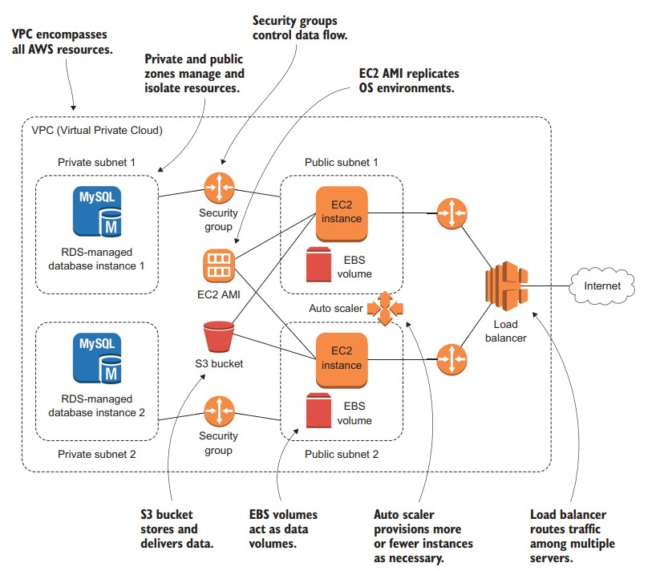

# Learn Amazon Web Services in a Month of Luches

How AWS data and security services are used to help an EC2 compute instance deliver its network-facing
application:
1. VPCs encompass all the AWS resources in an application deployment.
2. There are two kinds of subnets: private and public. They can be located in separate availability
zones and are used to manage and, where needed, isolate resources.
3. Security groups’ rules control the movement of data between resources.
4. The EC2 Amazon Machine Image (AMI) acts as a template for replicating precise operating system environments.
5. The Simple Storage Service (S3) bucket can store and deliver data for both backup and delivery
to users.
. Elastic Block Store (EBS) volumes act as data volumes (like hard drives) for an instance.
7. The auto scaler permits automatic provisioning of greater (or fewer) instances to meet changing
demands on an application.
8. The load balancer routes traffic among multiple servers to ensure the smoothest and most efficient user experience.

## Content
As you can see from the table of contents, I’ve divided the book’s chapters into three sections: the core toolset (chapters 2–12), high availability (chapters 13–17), and brief introductions to some of the AWS
services and functionality that didn’t fit into the book’s other sections
(chapters 18–20):
- [Chapter 1](/ch01%20Before%20you%20begin.md) introduces the cloud, the space within it that AWS
inhabits, and, in broad terms, the kinds of things you can accomplish there.
- [Chapter 2](/ch02%20The%2010%20minute%20EC2%20web%20server.md) is a quick-start project in which you’ll launch an actual
virtual machine on AWS EC2, serving a simple web server to the
internet.
- [Chapter 3](/ch03%20Provisioning%20a%20more%20robust%20EC2%20website.md) demonstrates capacity-analysis techniques and adds
WordPress to your EC2 server.
- [Chapter 4](/ch04%20Databases%20on%20AWS.md) introduces managed-database hosting on Amazon’s
Relational Database Service (RDS).
- [Chapter 5](/ch05%20DNS%20what%E2%80%99s%20in%20a%20name.md) shows you how to register and administer DNS domains
and routing policies using Route 53.
- [Chapter 6](/ch06%20S3%20cheap%2C%20fast%20file%20storage.md) addresses cheap, reliable, fast data storage using Simple
Storage Service (S3).
- [Chapter 7](/ch07%20S3%20cheap%2C%20fast%20system%20backups.md) demonstrates a couple of approaches to using S3 for
system and archive backups.
- [Chapter 8](/ch08%20AWS%20security-%20working%20with%20IAM%20users%2C%20groups%2C%20and%20roles.md) turns your attention to security through the IAM service.
- [Chapter 9](/ch09%20Managing%20growth.md) shows how you can (and must) work with AWS tools to
estimate and model the true costs of your projects.
- [Chapter 10](/ch10%20Pushing%20back%20against%20the%20chaos-using%20resource%20tags.md) demonstrates the far-reaching value of applying
resource tags.
- [Chapter 11](/ch11%20CloudWatch-monitoring%20AWS%20resource%20for%20fun%20and%20profit.md) promotes regular, smart monitoring of your resources
through CloudWatch.
- [Chapter 12](/ch12%20Another%20way%20to%20play%20-%20the%20command-line%20interface.md) introduces you to administering AWS resources
through the AWS command-line interface (CLI).
- [Chapter 13](/ch13%20Keeping%20ahead%20of%20user%20demand.md) discusses elasticity and scalability as they relate to virtual servers.
- [Chapter 14](/ch14%20Hight%20availability%20working%20with%20AWS%20networking%20tools.md) addresses organizing your infrastructure within VPCs
and availability zones to enhance their reliability.
- [Chapter 15](/ch15%20High%20availaability-load%20balancing.md) covers load balancing as a tool for intelligently directing client traffic among multiple servers.
- [Chapter 16](/ch16%20High%20avilability-auto%20scaling.md) shows how auto scaling can be used to automatically
manage changes in user demand and server health.
- [Chapter 17](/ch17%20High%20availability-content%20delivery%20networks.md) describes how the CloudFront content-delivery network can be used to reduce latency for geographically dispersed
users.
- [Chapter 18](/ch18%20Building%20hybrid%20infrastructure.md) illustrates the use of various tools to permit hybrid
local/cloud solutions.
- Chapter 19 discusses some AWS cloud-automation tools (specifically, Elastic Beanstalk, ECS, and Lambda).
- Chapter 20 briefly surveys some of the AWS tools I couldn’t properly cover in the book.
- Chapter 21 says, “Goodbye—it’s been great spending time with
you!”

## About the author
David Clinton is a system administrator, teacher, and writer. He has
administered, written about, and created training materials for many
important technology subjects including Linux systems, cloud computing (AWS in particular), and container technologies like Docker. Many
of his video training courses can be found on Pluralsight.com, and links
to his other books (on Linux administration and server virtualization)
can be found at https://bootstrap-it.com.