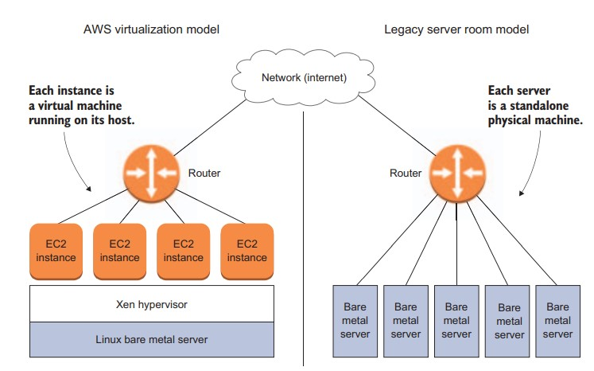
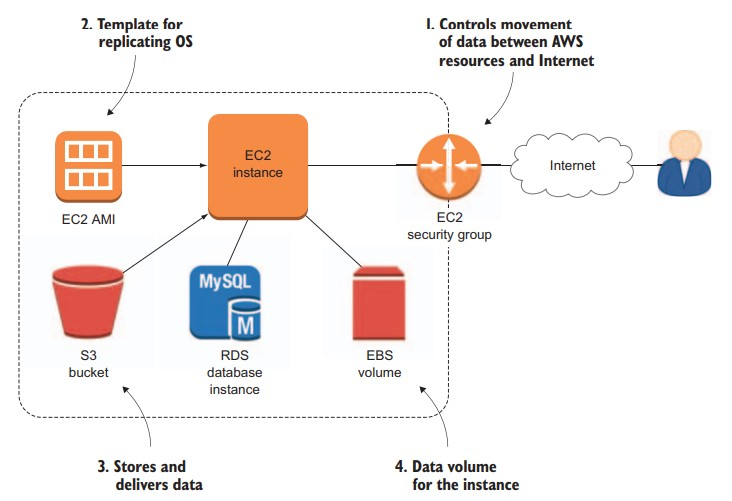

# Using this book
## The main chapters
To make this happen, the book is divided into three parts. Part 1, covering the first dozen chapters, loosely traces the step-by-step construction
of a WordPress-based website for an imaginary business by focusing
mostly on Amazon’s core compute (EC2), database (RDS), storage (S3),
security (IAM), and cost-management tools. You should definitely follow along at home (or wherever your “here” happens to be). Parts 2
and 3 of the book dig deeper into key cloud architecture concepts like
these:
- Scalability—The ability to accommodate greater demands on compute infrastructure
- Elasticity—The ability to quickly and dynamically incorporate new
virtual resources into existing infrastructure to meet demand
- High availability—The ability of a service to remain reliably available despite unpredictable 

## Hands-on labs
The Free Tier provides free access to lighter versions of just about every service AWS offers
for the first 12 months after you open a new account.

#  Setting up your lab environment
Of course, by lab environment I mean AWS account. If you haven’t already,
you’ll need to create one. Don’t worry: as long as you don’t fire up a
resource, just having an account won’t cost you anything. When you’re
logged in, the Console page (http://console.aws.amazon.com) is the
hub through which you can get stuff done.

# How AWS does it

Figure. An illustration of the way compute instances are virtualized within a single  physical server on AWS versus the use of individual physical machines in the legacy model.
##  The big picture
- The security group controls the movement of data between
your AWS resources and the big, bad internet beyond (chapter 2).
- The EC2 Amazon Machine Image (AMI) acts as a template for
replicating precise OS environments (chapters 2 and 7).
- The Simple Storage Service (S3) bucket stores and delivers
data for both backup and delivery to users (chapter 6).
- The EBS volumes act as data volumes (like hard drives) for an
instance (chapter 2)

Figure. The kind of deployment you should be able to build once you’ve read at least the first 12 chapters of this book