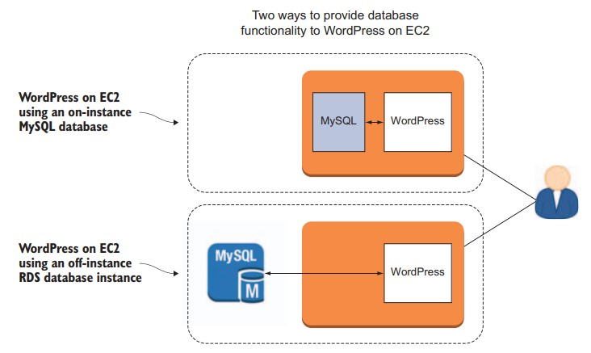
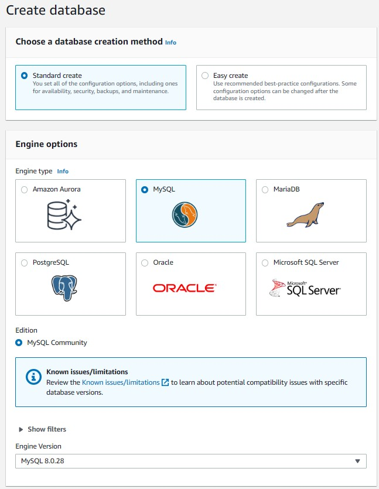
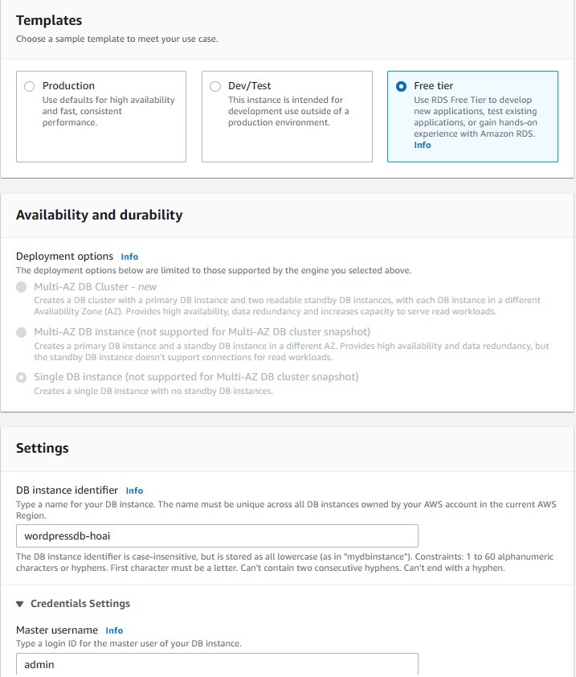
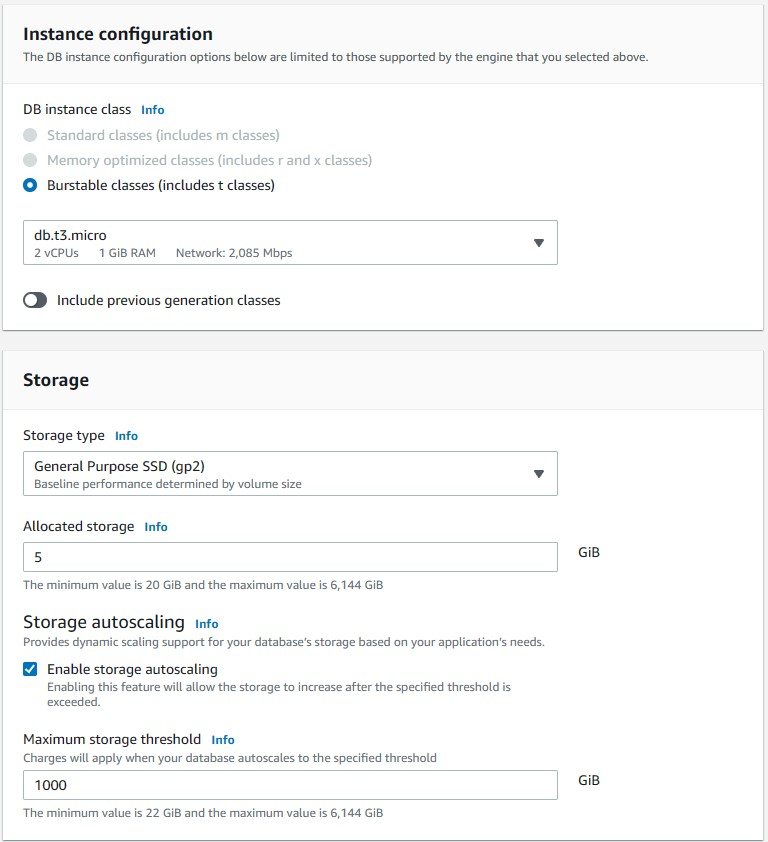
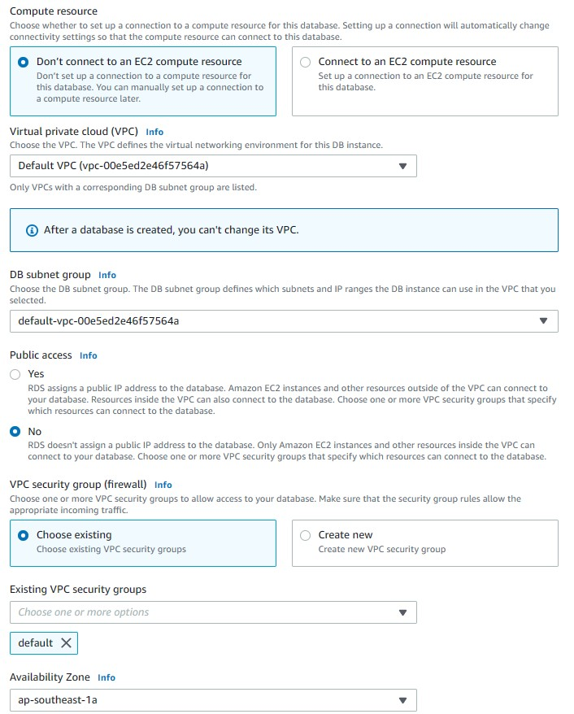
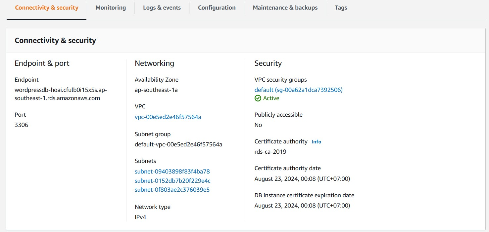

# Databases on AWS
## 4.1 The database
A database is software that’s
good at reading digital information and then reliably storing it in a
structured format so that the information can later be efficiently
retrieved in useful formats and combinations.

## 4.2 Choosing the right database model
The data world can get really complex, really fast. In practical terms,
though, it’s fair to say that most projects can be successfully served by
one of two database models: relational (SQL) and NoSQL.
### 4.2.1 Relational databases
Relational databases are often managed by one flavor or another of
the SQL standard. SQL stands for Structured Query Language, and the
“structured” part of that tells most of the story. An SQL-type database
(leading examples of which include Oracle, MySQL, PostgreSQL, Microsoft’s SQL Server, and, more recently, Amazon’s Aurora) is made up
of tables, which, in turn, contain records (or, as some call them, rows).

### 4.2.2 NoSQL databases
Imagine, for instance, that you’re building a wholesale
business that needs to handle constantly changing product descriptions
and inventory information for tens of thousands of items; that data, in
turn, must be integrated with sales, shipping, and customer service
operations.

In such a case, you’ll likely want to use a NoSQL database (such as
AWS’s DynamoDB): highly flexible relationships between NoSQL data
elements allow much simpler integration of data stored across multiple
clients and in different formats. This makes it possible to easily accommodate fast-growing data sources.

## 4.3 Infrastructure design: where does your database belong?
The WordPress project you created in chapter 3 was built on top of a
LAMP server. As you no doubt remember, that means WordPress stored
all of its data on the MySQL database you installed on the same EC2
instance you used for WordPress itself. That’s a common way to do
things for a lighter, less mission-critical deployment like a temporary
demo website or a hobby blog. But although such single-machine
arrangements can be simpler and inexpensive, simplicity and shortterm cost savings aren’t always the only goals.
 Here are some reasons you might want to install and run a database
off-instance (on its own dedicated server):
- Security: Isolating your various resources from each other on
completely separate machines can make it a lot easier to open up
what needs to be open and close off the rest. Databases usually
have significantly different access profiles than applications, so
they’re perfect candidates for this kind of separation
- Data accessibility: It’s common to launch more than one server as
part of a single application. This can be because each provides a
unique service, but it’s usually either so you can duplicate your
content to protect against the failure of any single server, or to
accommodate growing user demand. In any case, when you have
multiple application servers using the same data, it’s often a good
idea to keep your database separate.
- Hardware: Web or application servers often consume compute
resources differently than databases.
- Software: Suppose you have an application that requires a Windows server, but you want your data kept on a Linux machine.
Even if, technically, it can be done using the magic of virtualization, you may want to avoid the extra complications involved in
running both OSs on a single server.
- AWS RDS: Amazon Relational Database Service (RDS) provides a
fully managed database solution that can be easily integrated into
EC2-based applications. Managed means that Amazon takes care of
all the hardware and administrative worries and gives you a single
internet address (called an endpoint) through which to access the
resource.


WordPress running on an EC2 instance and accessing a database either oninstance or from a managed RDS instance

## 4.4 Estimating costs
To give you a sense of the instance you should choose, AWS offers three
type families, each with its own set of member instance classes: burst
capable class type (db.t2) are the cheapest instances, but despite their relatively weak specs, they can provide brief bursts of higher performance.
These make sense for applications that face only intermittent spikes in
usage. Standard (db.m4) instances are cost effective for sustained usage,
but their balance of resources may not give you enough to hold up
against extreme demand. And I’ll bet you can figure out the use case
for memory optimized (db.r3) instances all on your own.

## 4.5 Migrating your database to RDS
1. Make a usable copy of your existing database, which, by default, is
already populated and active. This is known as a database dump. 
2. Head over to the AWS Console to create an RDS instance. Make sure
a secure connection between it and your EC2 instance is possible.
3. Upload your saved database dump to the RDS database server.

### 4.5.1 Creating a MySQL dump
You’re ready to start the dump of the database. From an SSH session in
your EC2 instance, which you set up according to the instructions in
chapter 3, run this single command:
```
mysqldump -u wpuser -p wordpressdb > /home/ubuntu/mybackup.sql
```
**NOTE**

*If you’re working with the instance from chapter 3 after having
stopped and restarted it, it may have a new IP address. This may
require you to update values pointing to your site’s old IP address in
the wp_options table of your MySQL database. WordPress has directions at https://codex.wordpress.org/Changing_The_Site_URL. If
you’re not comfortable working with databases, these edits might cost
you more time and trouble than firing up a brand-new instance.*

## 4.6 Building an Amazon RDS instance
As long as your account is eligible for
the Free Tier, this won’t cost you anything. Click the RDS link in the
Database part of the Console page, and you’ll be taken to the RDS dashboard. Assuming you don’t already have an RDS instance running,
you’ll see a blue Get Started Now button.





## 4.7 Configuring security group settings


## 4.8 Populating the new database
Now, from the SSH session on the EC2 server, move to the directory to
which you saved your MySQL dump:
```
$ cd /home/ubuntu
$ mysql -h <endpoint> -u admin -p
$ create database wordpressdb;
$ quit;
$ mysql -u admin -p --database=wordpressdb --host=<endpoint> < mybackup.sql
```
Repalce `<endpoint>` by endpoint of your RDS endpoint


All that’s left is to enter the new endpoint into the WordPress `wp-config.php` file in the /var/www/html/ directory on your EC2 server:
```
$ sudo nano /var/www/html/wp-config.php
```
Check to be sure the `DB_USER` and `DB_PASSWORD` values are correct, and
then edit the hostname `DB_HOST` value to equal your RDS endpoint.