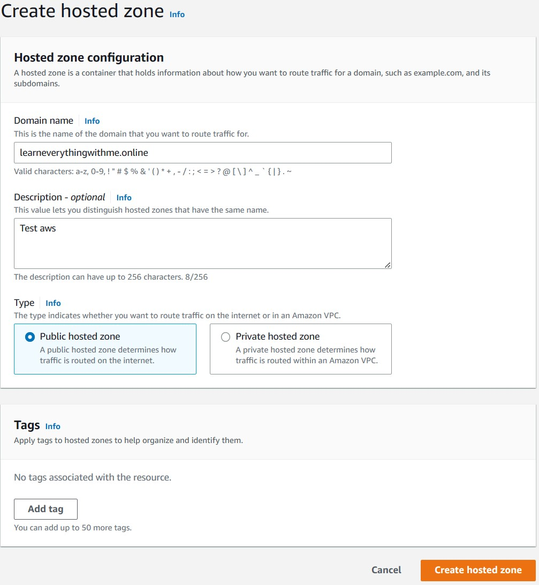
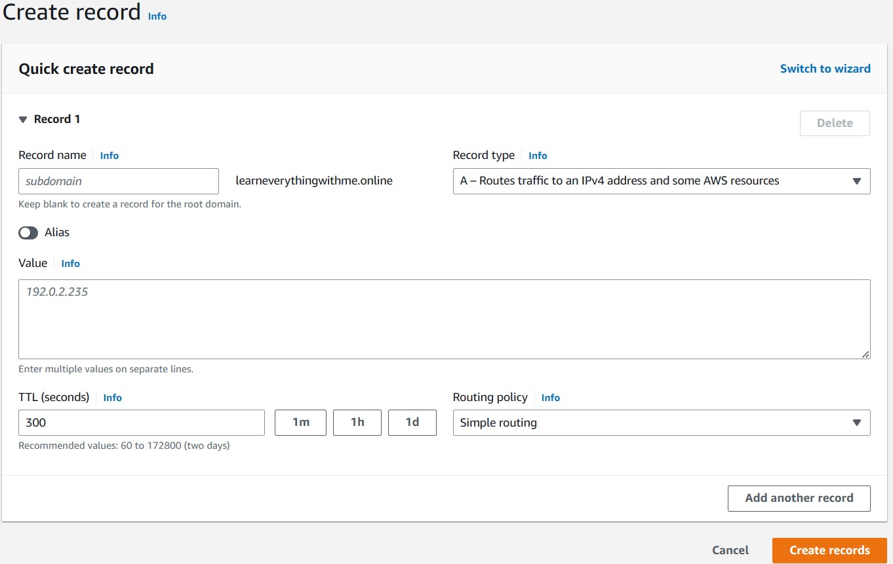
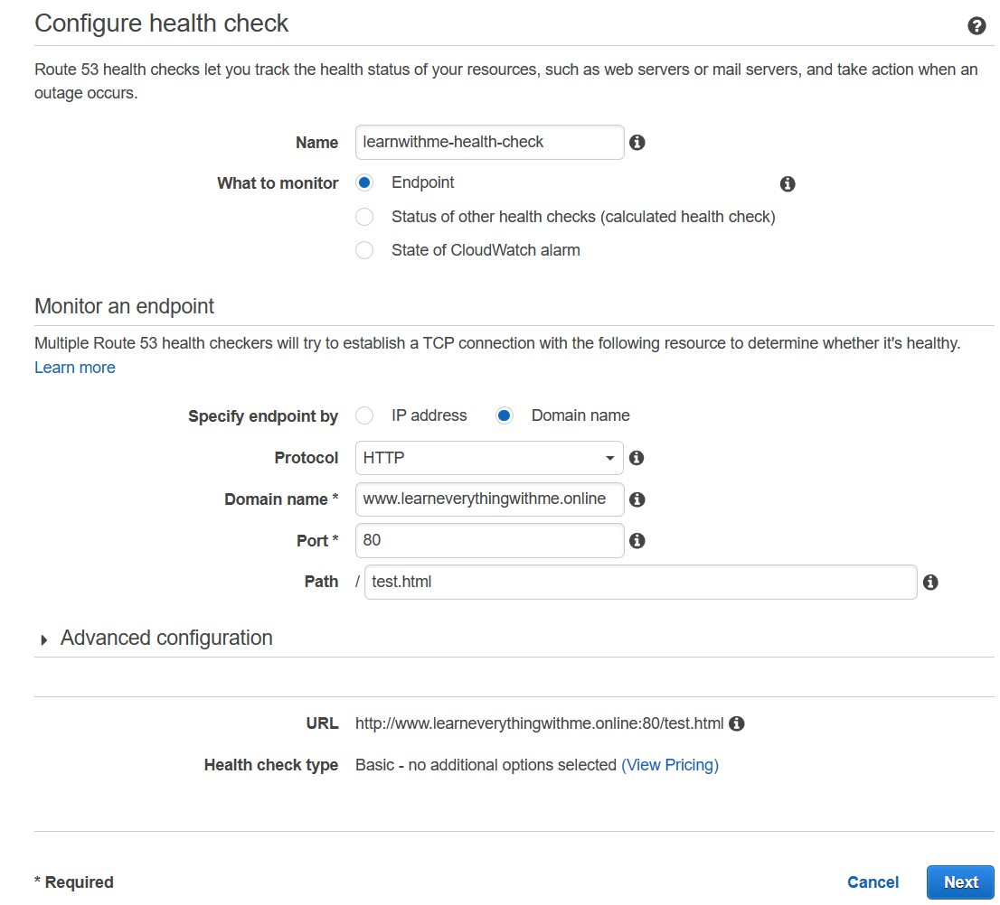

# DNS: what’s in a name?
The tool that translates back and forth between text-mad humans
and our more digitally oriented machines is called the *domain name
system* (DNS).

The first stop is usually a local index of names and their associated
IP addresses, stored in a file that’s automatically created by the OS on
your computer. If that local index has no answer for this particular
translation question, it forwards the request to a designated public DNS server that maintains a much more complete index and can connect you to the site you’re after. Well-known public DNS servers include
those provided by Google—which uses the deliciously simple 8.8.8.8
and 8.8.4.4 addresses—and OpenDNS.

In this chapter, you’ll use `Amazon’s Route 53` service to register a
domain name and associate that name with the IP address being used
by your website. This will tell name servers where to send traffic aimed
at your domain. You may eventually want to add instances of your server
to allow for more efficient and individualized service; to do this, you’ll
also learn how to use Route 53 to set up traffic redirection among a
pool of multiple servers.

## 5.1 Adding a name to public 
Route 53 is built to deliver four distinct
but closely related services: `domain registration` (Amazon, it turns out, is a
domain name registrar); `DNS management`, which is the tool you’ll use to
direct traffic to your domain; `traffic management`, to handle traffic redirection; and `availability monitoring`, to confirm that your target resources
are performing the way they’re supposed to. A bit later, I’ll explain how
you can use each of these features to productively manage the way users
experience your website.

First, though, you need to identify the domain name of your
dreams: something short, easy to remember, suggestive of what you do,
and, most of all, not already taken by someone else. Route 53 will tell
you if your choice is still available. Click the Get Started Now button
beneath Domain Registration, and then click Register Domain.

>**NOTE:** Nothing forces you to use Route 53 for your domain registration. In fact, you may find that other providers offer cheaper alternatives. You can use Route 53’s other features even for domains registered through other companies.

## 5.2 Configuring your hosted zone
Your domain is now registered, but you haven’t told it what to do with
incoming requests. So, from the dashboard, click Hosted Zones and
then Create Hosted Zone. Fill in your domain name, and, assuming you

### 5.2.1 Configuring record sets
Click the link to your new hosted zone, and you’ll find yourself on a
page with two pre-created record sets:
- *Start of authority (SOA)*—Identifies your domain’s basic DNS configuration information
- *NS*—List of authoritative name servers that can be queried about
your domain host. These are the public services that provide

Don’t mess with either of these two record sets. But they’re not enough
on their own to make your new domain name fully available. You need
to add at least one more record.

The time to live (TTL) rule determines how long a target value such as
the value of a DNS record provided by a name server will remain valid
before it’s automatically refreshed.

>**Note:** I’d be charged a fee of $0.50 for every month, regardless of how much work it was actually doing. To allow for experiments and testing, AWS doesn’t charge for zones that are deleted within 12 hours.

### 5.2.2 Elastic IP addresses
Which IP address should you use for this hosted zone? The public IP
that you were assigned when you created your WordPress site on EC2
will work, but using it would be a terrible idea. That’s because there’s
no guarantee that the address will be persistently associated with your
EC2 instance. If, say, your instance ever crashes, it will probably receive a
new IP address when it starts up again, thereby breaking all existing
links to your site.

Associating an `Amazon Elastic IP` address to your instance can solve
these problems by giving you a single, static address that you can closely
control.

 From the EC2 dashboard, click the Elastic IPs link in the left panel
and then click Allocate New Address. Confirm that this is what you want
to do, and, within a few minutes at most, the new Elastic IP will appear
in the dashboard.

When you click Associate, that instance will be publicly accessible through the Elastic IP.

## 5.3 Routing policies
The busier your website gets, the more likely it is that you’ll choose to
incorporate multiple servers into the overall design. You may do this to
make your content more highly available so that, even if one server
fails, traffic can be shifted to another one that’s still healthy.

- A *health check* is usually an automated, server-based process that periodically tries to load a specified remote web page to confirm that it’s still available. If the web page fails to load, a predetermined action like an email notification or an update of a routing configuration setting is triggered.
- A *routing policy* configures your networking software to base trafficrouting decisions on the contents or characteristics of the moving data, or on network conditions.

### 5.3.1 Creating a health check
You can create a simple health check and set it to notify you in the event
of a failure by clicking the Health Checks link in the left panel of the
Route 53 dashboard and then clicking Create Health Check.

### 5.3.2 Create a routing policy
Although not every deployment will require this, sometimes you’ll want
to route (that is, redirect) customer traffic among multiple servers.
Route 53 provides routing policies as a tool for managing that situation.

- *Simple Routing Policy*—Follows the values in a resource record set pointing to a single server.
- *Weighted Routing Policy*—Allows you to direct higher or lower proportions of your total traffic to specified servers. Useful for cases where one server has greater capabilities than another.
- *Latency Routing Policy*—Directs users to the specific server that will be able to respond with the lowest latency (that is, delay).
- *Failover Routing Policy*—Redirects traffic away from a server that’s failed to a backup server.
- *Geolocation Routing Policy*—Directs users to the server that’s located in the AZ geographically closest to them.

In this case, select the Failover rule, which launches a dialog box with
two panels: one for a primary server and one for its secondary backup.