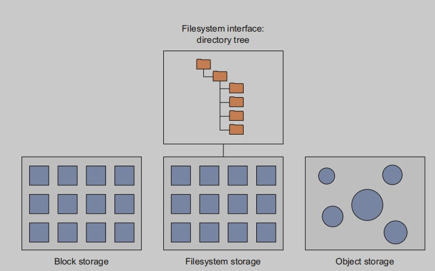
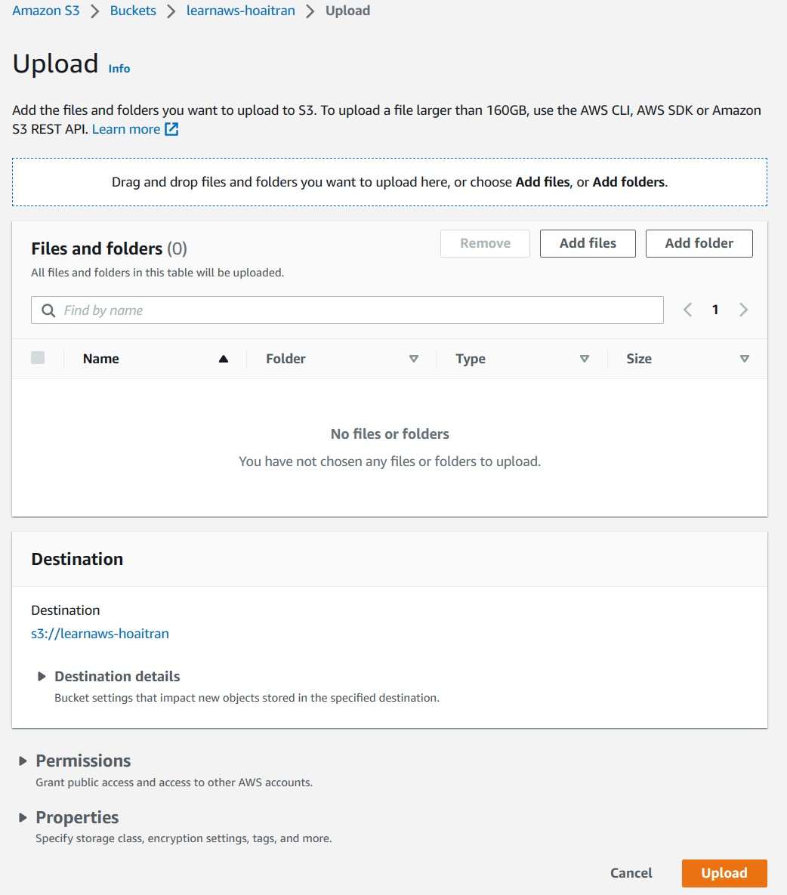
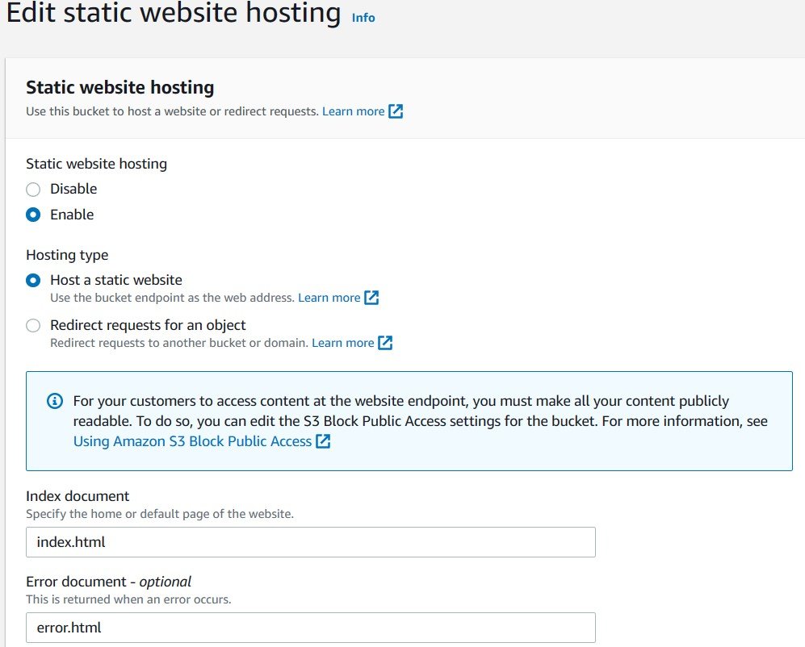

# S3: cheap, fast file storage
In this chapter, you’ll learn how S3 works, how you can both gain and
control access to it, how to quickly integrate the resources you store on
S3 into your applications, and, finally, how you can use S3 to create a
super-cheap, super-simple static website.

## 6.1 How does S3 work?
S3 provides fast, inexpensive object storage. But what exactly is object
storage? As you can see in figure 6.1, unlike block storage, which organizes data in blocks directly on a physical medium, or filesystems, which
provide hierarchical representations of files and directories to make
very large groups of files easier to work with, object storage systems are
organized around data objects that can contain files. No matter how
large or small a single object may be, an object storage system will write
it to a single location. The system will also add metadata to identify the
object’s basic vital information and assign it a URL (a network-friendly
address) through which it can be accessed.

Figure 6.1 Differences in design between block storage, filesystem storage, 
and object storage

### 6.1.1 Creating an S3 bucket
Click `Create Bucket` to open the `Create Bucket wizard`. First, you’ll need
to choose a bucket name. Because the name you choose will become an
important part of the bucket’s URL, it must be completely unique
among all S3 buckets across the system.

- `Versioning`—When enabled, versioning saves copies of files even
when newer versions with the exact same name are uploaded.
Rather than being overwritten and lost, files stored in versioned
buckets remain available for later retrieval. By default, versioning
is disabled.
- `Logging`—Logging tracks all access requests against the bucket. If
you may be subject to audits or security regulations—or if you’re
just plain curious about who’s using your resources—then you’ll
want such an activity record.
- `Tags`—Chapter 10 discusses using resource tags to manage a busy
AWS account. If you expect to create dozens or hundreds of S3 buckets, then applying an intelligent system of tagging can make
your data much more usable. This is where it’s done.
- `User management`—You can provide varying levels of access to the
contents of a bucket to other users, to allow resource sharing.
- `Permission management`—You can open access to your bucket
contents to either all authenticated AWS users or anyone on the
internet.

### 6.1.2 Uploading files to an S3 bucket

## 6.2 Integrating S3 resources into an  EC2-based website

Suppose you’d like to embed an S3-hosted video into a WordPress
page or blog post, so visitors can view the video inline on the page.
Here’s how to do it. On the Edit Post page of the WordPress admin
interface, click the spot on the page where you want to insert the video,
and paste the URL link of an S3-hosted video.
That’s it! WordPress can take it from here.

## 6.3 Using S3 to create a simple static website
A static website is a site whose content doesn’t rely on a server-side
scripting language like Java or PHP or on calls to a database. That
means you can’t run a WordPress instance directly on S3.

How do you set up a static site? It’s easy. On the main S3 page, click
the name of the bucket you want to use. Doing so takes you to the page
with all the settings tabs. This time, click the Properties tab. One of the
tiles you’ll see is Static Website Hosting: click it to go to the hosting
setup form. Tell S3 which document in the bucket
should be loaded by default when a user visits (by convention, usually
index.html) and how redirects and errors should be handled. Note the
site’s URL (actual URL) at the top.

Click Save. All that’s left is to create a file called index.html on your
computer (why not use the same HTML code you used earlier for the S3
video?) and upload all of the site’s files and resources to your static website bucket. Don’t forget to assign Everyone/Read permissions to all
your files so they’ll be publicly accessible.