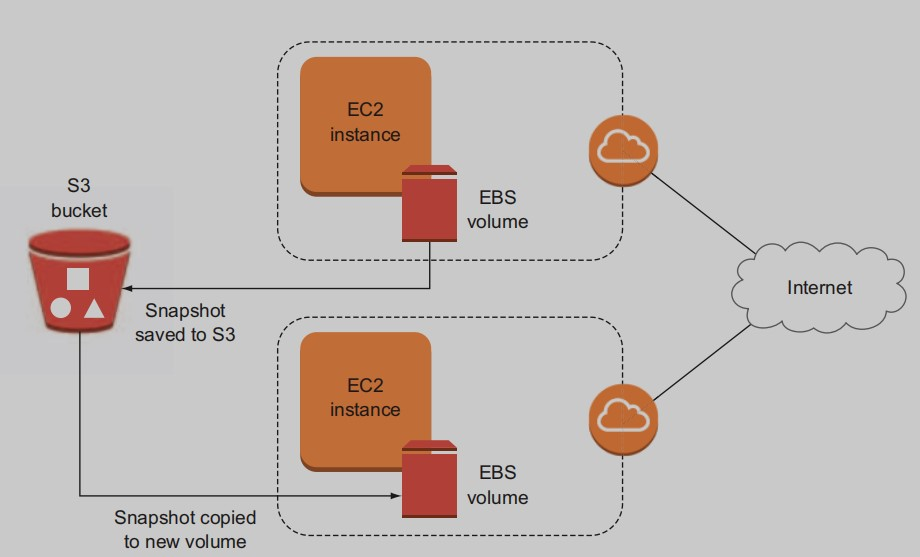
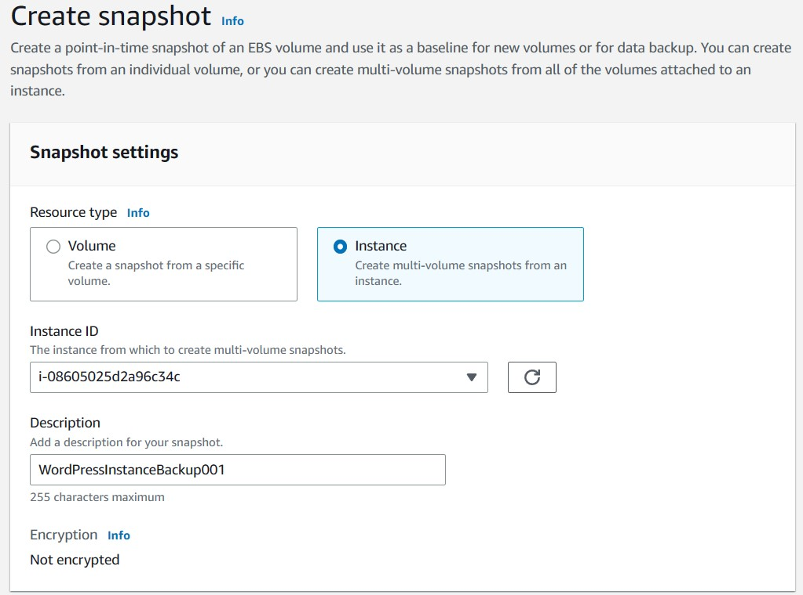

# S3: cheap, fast system backups
In this chapter, we’ll talk about how important it is to back up your
data, and how backups relate to the needs and opportunities unique
to AWS-based data. We’ll also discuss how backups of AWS resources
can work differently from the kinds of backup operations you may be
familiar with from local deployments.
 Specifically, I’ll demonstrate two approaches to managing backups
on AWS: 
- Having AWS take *a snapshot* (make a complete copy) of an AWS
Elastic Block Store (EBS) volume your EC2 instance is using and
save it to S3
- Using local OS tools to compress your data into an archive file
that will then be sent to an S3 bucket you specify for storage

## 7.1 Why back up?
### THE TROUBLE WITH HACKERS
The way I’m using the term here, hackers refers to criminals who wish to
gain control of your data or infrastructure.

### THE TROUBLE WITH ADMINS
Administrators like you and me may make mistakes while managing
systems, irretrievably corrupting important configuration files in the
process.

## 7.2 Backing up to S3: snapshots


### 7.2.1 Creating a snapshot


### 7.2.2 Creating an image
From the Snapshots page, follow these steps:
1. Select your snapshot, and then click Actions.
2. Click Create Image.
3. Enter a name for the image in the dialog box that opens.

The other default values should all be fine, with one serious exception.
Assuming your original instance was created using a mainstream AMI (if
you followed along in previous chapters, it was), it used a virtualization technology known as hardware virtual machine (HVM).

### 7.2.3 Using an image to re-create an instance
This is the easy part. Click the AMIs link in the navigation panel at left
on the EC2 dashboard, select the image you previously created (and, I
hope, identified with a useful name), and click Actions and Launch.
That’s it. From here, you’re taken directly to the second step of the normal instance-launch process, where you can set networking, security,
and storage options.
 Confirm that everything is working by trying to log in to your new
instance using SSH. You can also browse to its public website using the
new IP address it’s been assigned.

## 7.3 Backing up to S3: manial process
S3 it is, then. Here’s what you’ll do:
1. Use the Linux `tar` program to generate a compressed archive of
the files you’d like to copy. There’s no point in needlessly copying
larger files back and forth when you can compress/decompress
them at either end.
2. Install and configure the AWS command-line interface, which will
make it easy to copy your archive to an S3 bucket that you’ll create.
3. Perform the copy operation, and confirm that the file has reached
its destination.

### 7.3.1 7.3.1 Choosing what to back up
Before you start, I’ll devote a few moments to the problem of what to
back up. If your Linux web server suddenly crashed, which files could
be easily replaced, and which would be sorely missed?

A lot depends on how you’re using your server and whether it’s
being accessed by other users. For instance, if you’ve given user
accounts to a few developers, then you should probably assume they
have some of their own data in their home directories (in the `/home/` directory hierarchy). They may also have installed their own tools beneath the `/usr/` directory. And, of course, you’ll need to account for
the website files that probably live in `/var/`, and the configuration files
in `/etc/`.
### 7.3.2 Generating a compressed archive
```
$ cd ~
$ tar czf mybackup.tar.gz /etc /var /home
```
The `.tar.gz` filename extensions aren’t necessary, but they’re a convenient way to remind
yourself that the file will be a tar archive that’s compressed using the `gzip algorithm`.

### 7.3.3 Installing the AWS CLI
The AWS command-line interface (CLI) is a powerful program that effectively lets you remotely control all of your AWS resources from the command line of any internet-connected computer.

Install AWS CLI for Linux
```
$ sudo apt update
$ sudo apt install unzip
$ curl "https://s3.amazonaws.com/aws-cli/awscli-bundle.zip" -o "awscli-bundle.zip"
$ unzip awscli-bundle.zip
$ sudo ./awscli-bundle/install -i /usr/local/aws -b /usr/local/bin/aws
$ /usr/bin/python virtualenv.py --python /usr/bin/python/usr/local/aws
$ /usr/local/aws/bin/pip install --no-index --find-links/>file:///home/ubuntu/awscli-bundle/packages awscli-1.11.64.tar.gz
$ /usr/local/bin/aws --version
```
Back in your terminal, you’ll set up the AWS CLI. Run aws configure:
```
$ aws configure
$ aws s3 cp mybackup.tar.gz s3://YourS3BucketName
```