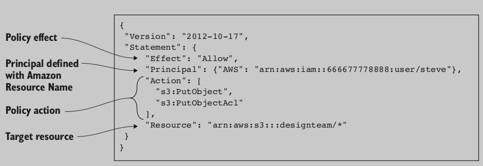
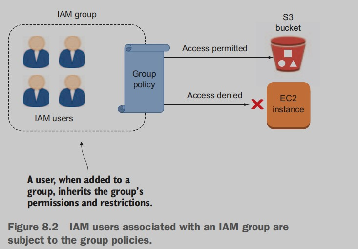
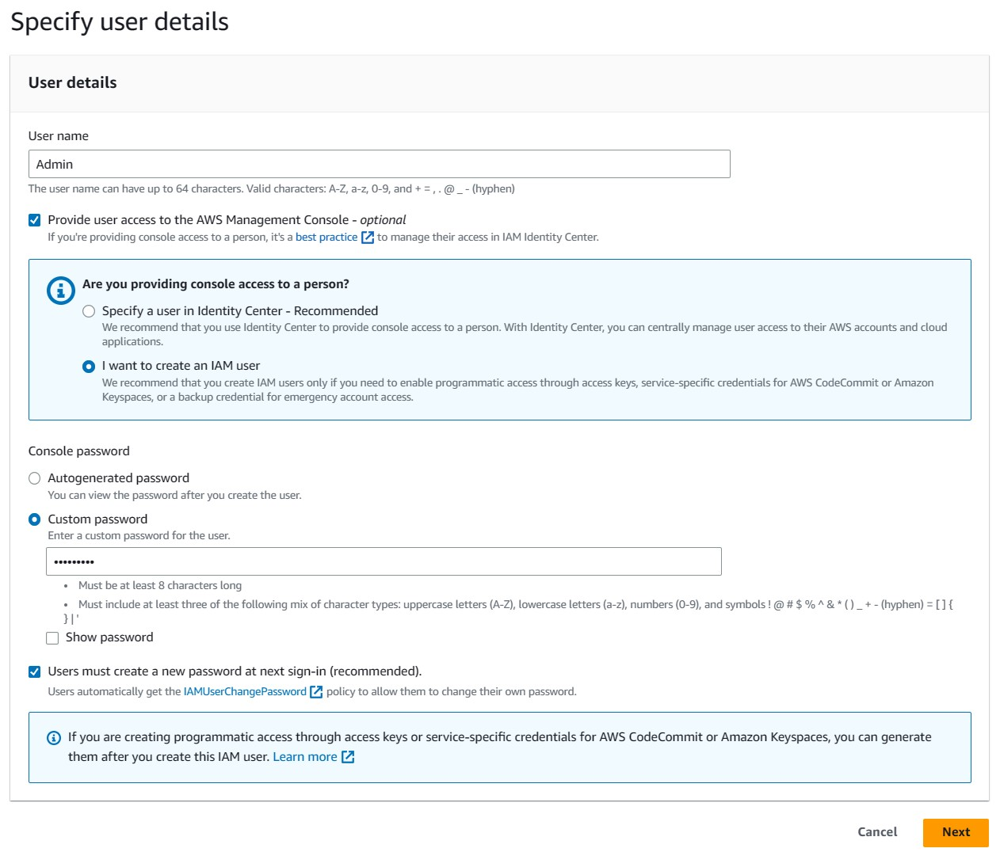
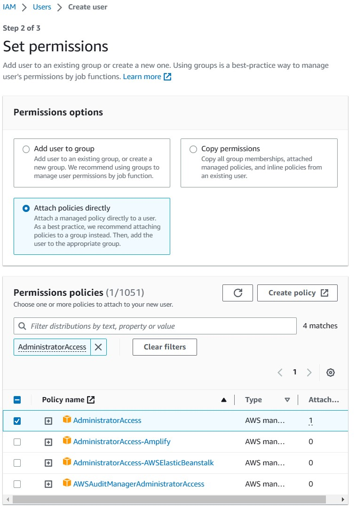
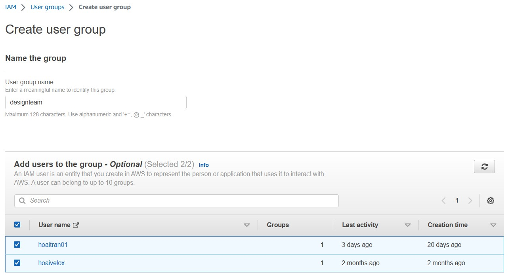

# AWS security: working with IAM users, groups, and roles

## 8.1 Defining the pieces of the IAM picture
Controlling access through account authentication works best when it’s
precisely configured. And configuration works best when the admin
doing it is deeply familiar with all the tools in the closet. So let’s spend a
little time understanding how each of IAM’s many moving parts works.

### 8.1.1 Policies
The policy code shown in figure 8.1 permits the user Steve—represented here as `Principal` by his unique **Amazon Resource Name** (ARN) identifier—to put objects into an existing
S3 bucket called `designteam`. The put permission is set as part of the
`Action` section, and the specific S3 bucket is identified by its ARN on the
`Resource` line. The actual permission is enabled through the value
given to `Effect`. In this case, that’s `Allow`. You’ll see how such a policy is
applied a bit later. All this assumes, of course, that both a user account
for Steve and a `designteam` bucket have already been created (stuff
you’ll get around to doing soon).

### 8.1.2 Users
**PROTECTING YOUR ROOT USER ACCOUNT**
Although it may seem a bit strange, it’s strongly recommended that you
lock down your root AWS account and use a regular user account for
your day-to-day activities. By lock down I mean do the following:
- Create a really strong password and store it in a safe place.
- Create a surrogate administrator user with somewhat limited power.
- Delete your root access keys (to prevent anyone from accessing and hacking your root account).
- Avoid logging in to the console using your root account.

An **IAM user**, on the other hand, starts with no powers of any sort. You
can assign whatever permissions it will need to get its job done, but its
reach is limited, which means an attack against it won’t necessarily be as
catastrophic.

### 8.1.3 Groups
The idea is that, rather than defining and frequently updating complicated policies for each user, you can update the group policies, and
all of its members will automatically inherit the changes. This way, for
instance, adding a new developer to the system will only require that
you create a single new user account and then add it to your preexisting
developers group (see figure 8.2).

### 8.1.4 Roles
Individual team-member access can be defined by managing users and
groups. But permissions and rights can also be assigned to objects like
EC2 instances and applications through *roles*.

A role is a creature of a nature somewhere between a user and a pol￾icy. Like a user, a role is an identity that has specified restrictions and
permissions. But a role isn’t the property of any particular user, and its
privileges can’t be reached through normal login methods. Instead, an
object, once properly authenticated, can temporarily switch to a role
whose access policies are then applied to the user, replacing any rights
or restrictions that may have previously applied.

### 8.1.5 Best practices
Figuring out how to use IAM tools to make your AWS account as secure
as possible is fairly straightforward: consult the Security Status checklist
on the main AWS Dashboard. As you can see in figure 8.3, you’re
advised to do the following:
- Lock down your root account (as discussed earlier).
- Activate multi-factor authentication for the root account, and
work through users and groups rather than through a single root
account (as we’ll discuss shortly).
- Create an IAM password policy to enforce at least minimal password quality standards.

**MULTI-FACTOR AUTHENTICATION (MFA)**\
MFA requires users to log in using both a password and an authentication code that’s been sent to a preapproved device, such as a smartphone.

**ACCESS KEYS**\
Adding the two identifying codes that make up your access
keys (one access key ID and one secret access key) to a local configuration or to your application code can simplify access.

## 8.2 IAM-ifying an AWS account
### 8.2.1 Creating an admin user
Head over to the IAM Dashboard. You can get there from the AWS Console by clicking the Identity and Access Management link. Click the Users link on the left panel, and then click the big blue Add User button at the top of the main panel. Let’s create an account named **Admin** to serve as your new day-to-day administrator.

### 8.2.2 Signing in as an IAM user
Great—you’ve got a brand-new IAM user who’s all set to take over the
farm from your tired old root user. Just one problem: how is Steve supposed to log in to the Console so he can start work? There’s no email
address associated with his account, so the normal login page won’t
work. Do you suppose there’s a special account-level login page somewhere? Why, yes, there is! Go back to the main IAM page. An accountspecific sign-in URL is displayed toward the top of the page, as shown in
figure 8.9. All Steve will need to do is paste that URL into his browser
and then enter his username ("Admin") and the password you generated previously.

### 8.2.3 Creating and configuring a group
Remember how you embedded an
S3-hosted video in a WordPress page? Well, suppose your design team
was regularly producing updated versions of that video. You certainly
don’t want to give them full access to the AWS account, but you also
don’t want to force them to email you the files so you can manually
upload them into the S3 bucket. Is there a way for them to directly
upload their new files?

You guessed it: you’ll create a designers’ group in IAM and add the
design team members to it. Then you’ll attach a policy to the group that
permits both read and write access to S3 resources.

Click the Groups link in the left panel of the IAM page to go to
Users. Then click Create New Group. Enter designteam for the Group
Name in the next window, and then click Next Step to go to the Attach
Policy page. You want to give group members access to your S3 bucket,
so type s3 in the filter box to see what AWS suggests. Of the three possibilities, AmazonS3FullAccess is the one that meets your needs.