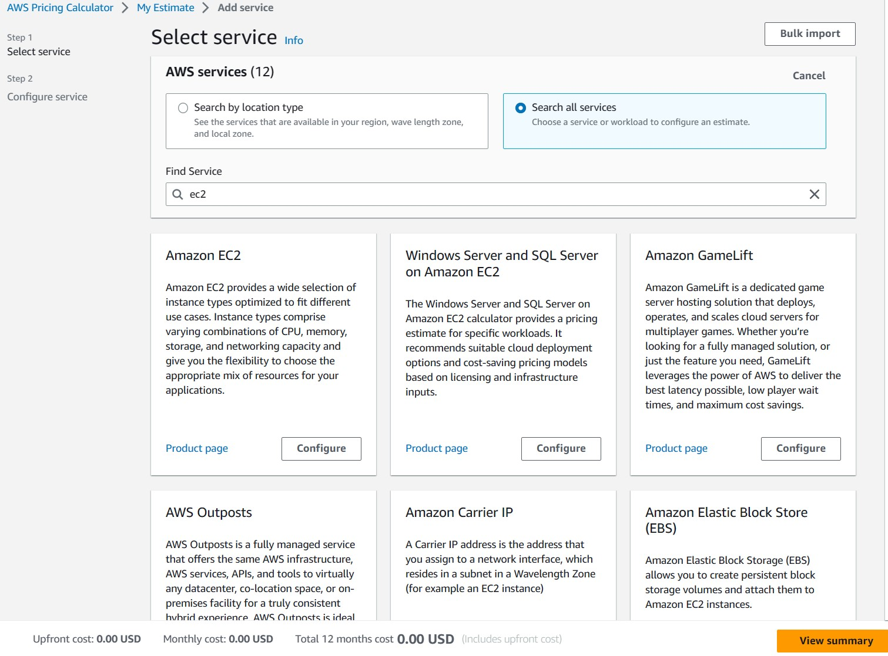

# Managing growth
## 9.1 Estimating the true costs of your cloud project
When the Simple Monthly Calculator was built, AWS fed it the entire
insanely complicated cost matrix for the entire AWS system. That means
the current rates for every kind of service and data transfer—including
EC2 and RDS instance types, S3 buckets, and EBS storage volumes—are
considered. You just tell it about all the pieces you need for your project, and the software will estimate the total costs you’ll face.

The real power of the calculator lies in how it lets you model as many
alternate scenarios as you like. That means you can, for instance, accurately cost out adding a new tier of services and compare the results to the income your accounting team thinks the extra power might generate. When you’ve got a resource combination you think makes sense, you can—from the Estimate of Your Monthly Bill tab—click Save and Share to create a unique URL. You can then send that URL to your team members (and CEOs) for their feedback and approval (or, alternatively, scorn and ridicule).

