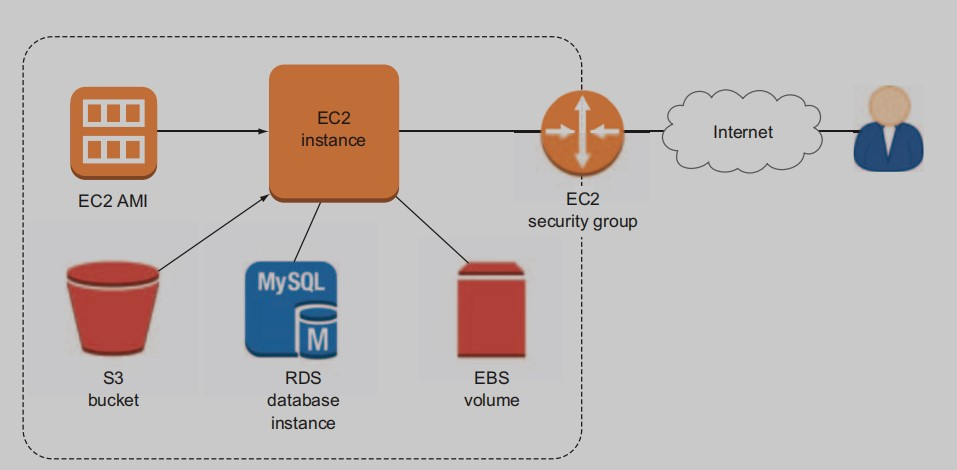
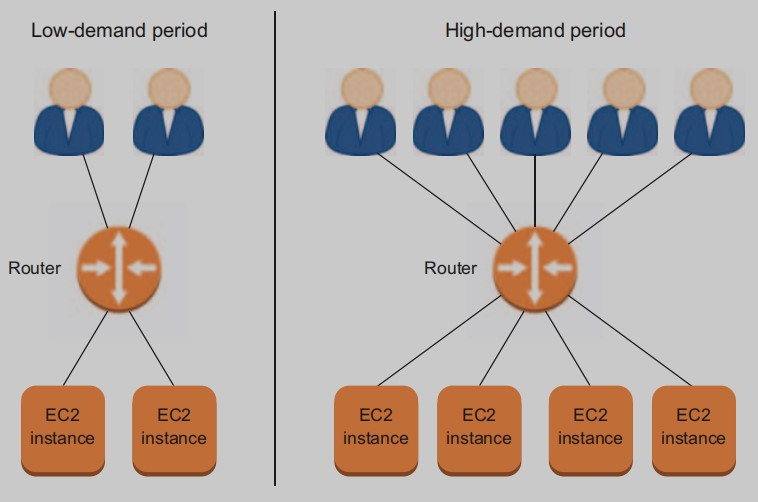
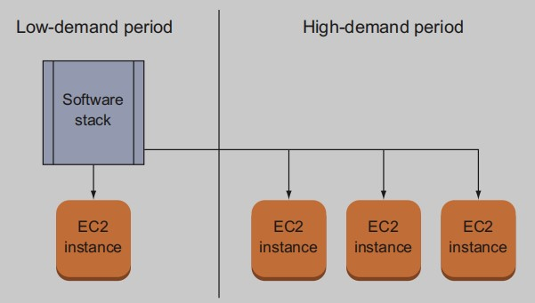

# Keeping ahead of user demand

That means you’re now familiar
with the following:
- EC2 instances, Amazon Machine Images (AMIs), and the
peripheral tools that support their deployment, such as security
groups and EBS volumes
- Incorporating databases into applications, both on-instance and
through the managed RDS service
- Using S3 buckets to deliver media files through your EC2 applications and for server backup storage
- Controlling access to your AWS resources with Identity and
Access Management (IAM)  Managing growing resource sets by intelligently applying tags
- Accessing resources using either the browser interface or the
AWS command-line interface (CLI)

Figure 13.1 This is the kind of application infrastructure you should be able to build 
on your own, having read the first dozen chapters of this book.

But things are running nicely—who needs optimization? Well, as customer demand on your WordPress site continues to grow, you’ll care,
and in a big way. You see, for some reason—perhaps related to the fact
that you discount the price of your product by 75% for half an hour
each evening—most customers arrive in the early evening, local time.
The single server you’ve been running is largely unused most of the
day, but it melts under the pressure of thousands of visits squeezed into
such a short stretch of time.
 And then there’s a question one of the guys in the office asked the
other day: “Our entire business is running on a single web server. What
happens if it goes down?” What indeed.
 You could provision four or five extra servers and run them full time.
That way, you’d be covered for the high-volume periods and for the failure of any one server. But that approach would involve colossal waste,
because for much of each day you’d be paying for most of the instances
to sit idle.

## 13.1 Automating high availability
This will be the subject of the next few chapters. You’ll learn
to use AWS’s geographically remote availability zones to make total
application failure much less likely; load balancing to coordinate
between parallel servers and monitor their health; and auto scaling to
let AWS automatically respond to the peaks and valleys of changing
demand by launching and shutting down instances according to need.

Figure 13.2 will help you visualize how all that infrastructure can be
made highly available through the magic of network segmenting, auto
scaling, and load balancing.
1. A virtual private cloud (VPC) encompasses all the AWS resources
in your application deployment.
2. There are two kinds of subnets—private and public—that can be
located in separate availability zones and are used to manage and,
where needed, isolate resources.
3. Security-group rules control the movement of data between
resources.
4. The EC2 AMI acts as a template for replicating precise OS environments.
5. The S3 bucket can store and deliver data, both for backup and for
delivery to users.
6. The EBS volumes act as data volumes (like hard drives) for an
instance.
7. The auto scaler permits automatic provisioning of more (or
fewer) instances to meet changing demands on an application.
8. The load balancer routes traffic among multiple servers to ensure
the smoothest and most efficient user experience.

Figure 13.2 An illustration of how AWS data and security services work together to allow an EC2 
instance to deliver its application

## 13.2 Cloud 
The U.S. National Institute of Standards and Technology (NIST) defines
cloud computing as services that offer users all of these five qualities:
- `On-demand self-service`—Customers can access public cloud
resources whenever needed and without having to order them
through a human representative.
- `Broad network access`—Cloud resources are accessible from any
network-connected (that is, internet) location.
- `Resource pooling`—Cloud providers offer a multitenant model,
whereby individual customers can safely share resources with each
other; and dynamic resource assignment, through which
resources can be allocated and deallocated according to customer
demand.
- `Rapid elasticity`—Resource availability and performance can be
automatically increased or decreased to meet changing customer
demand.
- `Measured service`—Customers can consume services at varying levels
through a single billing period and are charged only for those
resources they actually use.

## 13.3 Elasticity vs. scalability
What makes an elastic band **elastic** is partly its ability to stretch under
pressure, but also the way it quickly returns to its original size when the
pressure is released. In AWS terms, that would mean the way, for
instance, EC2 makes instances available to you when needed but lets
you drop them when they’re not, and charges you only for uptime (see
figure 13.3).

Figure 13.3 Elasticity allows for systems to dynamically add or remove 
resources to meet changing demand.

**Scalability** describes the way a system is designed to meet changing
demand. That might include the fact that you have 24-hour access to
any resources you might need (which, of course, is an elastic feature),
but it also means the underlying design supports rapid, unpredictable
changes. As an example, software that’s scalable can be easily picked up
and dropped onto a new server—possibly in a new network environment—and run without any manual configuration.

Figure 13.4 Scalable software can be easily copied for use in 
multiple servers deployed in multiple network environments.

- *Horizontal scaling* is scaling out: you add more lightweight server
nodes (or instances) to meet growing demand.
- *Vertical scaling* is scaling up: you move your application from a single lightweight server to one with greater compute capacity.