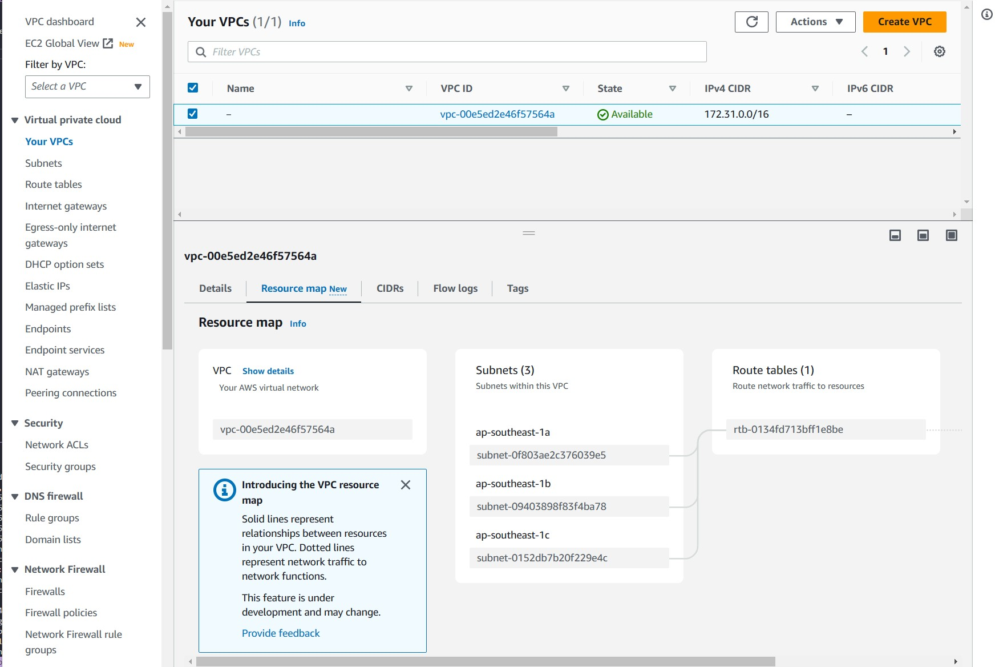
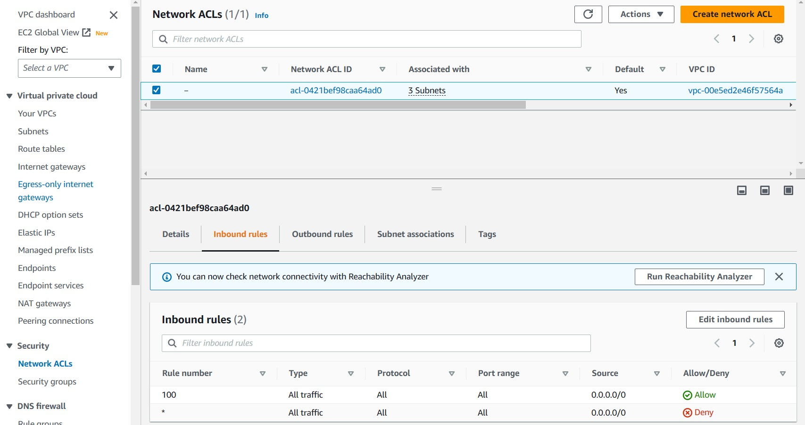
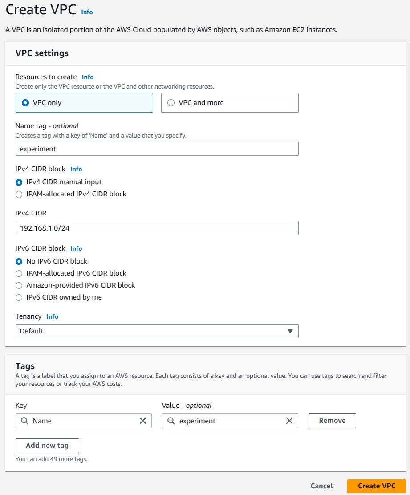
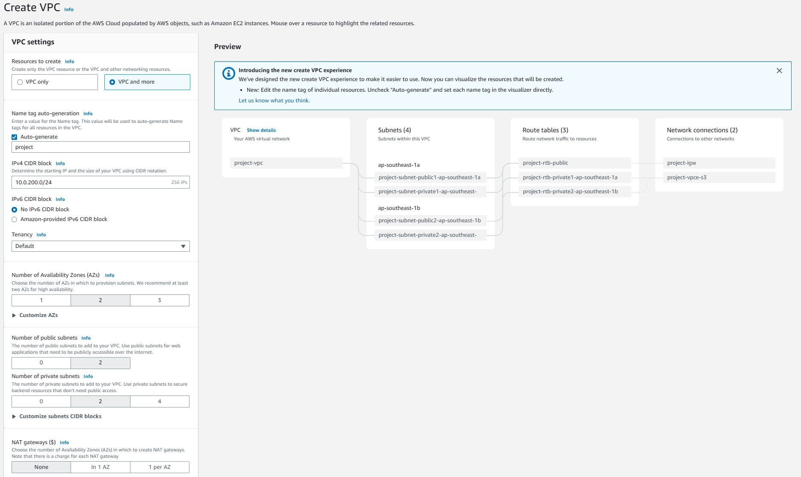
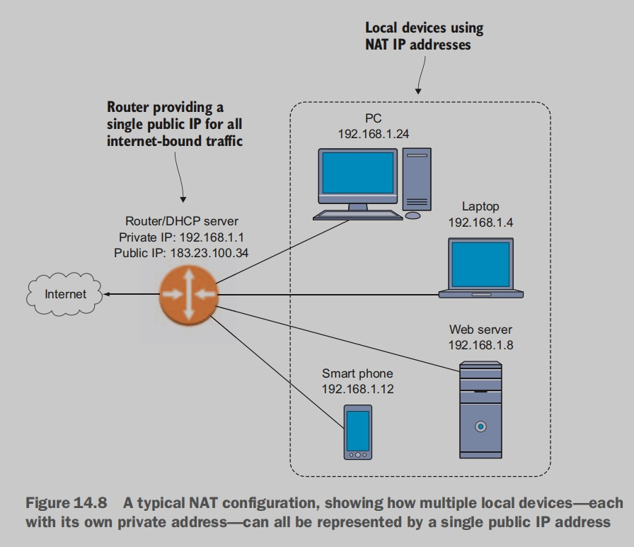
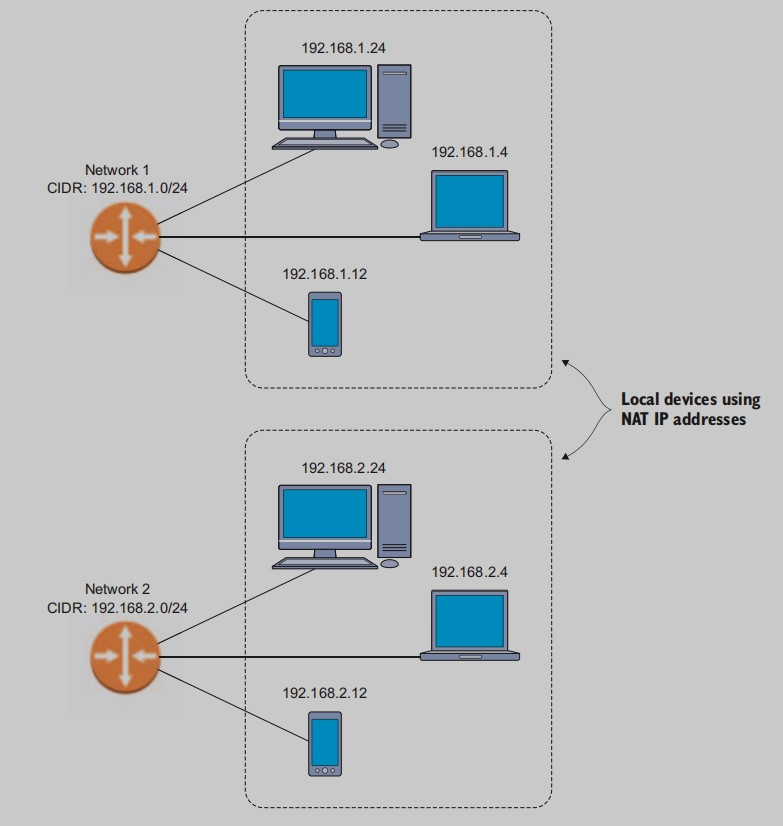
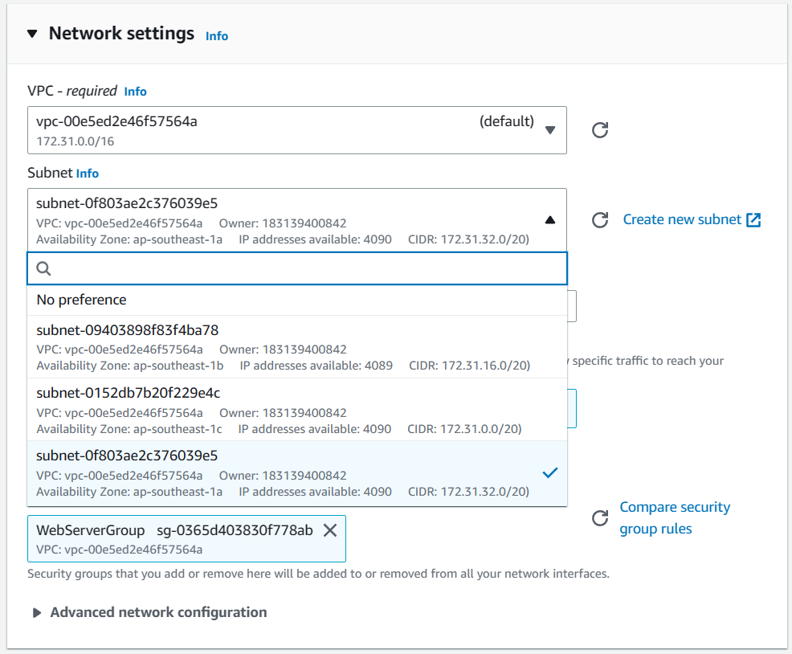

# High availability: working with AWS networking tools

## 14.1 Organizing AWS resources in VPCs
A VPC is a framework that ties together a bunch of highly configurable routing, access-control, and networking tools. When you launch resources—such as EC2 instances—in a VPC, they automatically
inherit the VPC’s security and connectivity settings.

The Route Tables page. Note the link to an internet gateway.

A network access control list (ACL) contains rules that control what
kinds of network traffic is allowed both into and out of the VPC. You can
click the ACL link back on the details page for your default VPC (note
that the object’s ID starts with acl), and you’ll be taken to the details
page for the ACL.

The Network ACLs page. By default, all inbound traffic is permitted.

### 14.1.1 Creating a new VPC
One of the great benefits of VPCs is the way you can use them to neatly
organize your resources. Not only can you protect and enhance the
stuff that lives in a VPC, but you can also define that stuff by the fact that
it doesn’t live in the VPC next door. In other words, you can segment
your resources, perhaps placing all production resources in one VPC,
marketing resources in another, and instances used for testing and stagging in a third.

**CREATING A VPC: THE MANUAL METHOD**

Manually creating your own VPC works, but it doesn’t automatically
populate it with all the bits and pieces (like an internet gateway) that
you might like to have. Nevertheless, the manual approach is useful for
building nonstandard designs from the ground up, and you should
keep this tool in mind.

**CREATING A VPC: THE WIZARD**
For most purposes, fresh new VPCs come into this world by way of the
Start VPC Wizard button on the main VPC dashboard page.

The VPC Wizard page, whose useful documentation can make selecting a VPC architecture easy.

>WARNING: At this point, the VPC Wizard will automatically create a NAT instance along with each new public/private subnet VPC. The goal is to enable secure communication with resources on the private subnet. But you should be aware that the NAT instance isn’t covered by the Free Tier and will incur costs for each hour it’s running.

## 14.2 Availability zones and network subnets
Network
protocol conventions are primarily concerned with connecting devices
to each other so they can easily communicate and exchange data. But
they can also be used in the service of data security and data reliability.
To achieve those goals, you need to learn to properly manage your AWS
resources in VPCs.

### 14.2.1 Network design
Why might you want to do this? Why not keep all your devices in a single
network so you don’t have to worry about defining individual subnets?
Here’s where we come to the two considerations I just mentioned: data
security and data reliability.

- DATA SECURITY:
Your company may want to keep the resources used by various operations separate from each other. You definitely don’t want to provide
general, company-wide access to the HR department’s database, with all
of its personal information. And those fragile staging servers where
your developers are doing their work—you need to make sure no
clumsy-fisted Luddites from marketing accidentally find their way in.
Well-planned subnets can effectively control access by resource class,
ensuring that only the right traffic gets in and out. 
- DATA RELIABILITY:
Remember the web app from the previous chapter—the one about
which they asked, “Our entire business is running on a single web
server; what happens if it goes down?” That was a great question. But,
“What if the server happens to go down?” is just one problem. “What if
the office or data center burns down?” is also a consideration.

It turns out that subnets on a single parent network can be located in
availability zones many miles from each other—not only in different
buildings, but in separate data centers. You can use subnetting to replicate your infrastructure across widely distant physical locations, ensuring that even if a disaster strikes one area, you’ll still have the other one
to fall back on.

### 14.2.2 TCP/IP addressing
For decades, the standard address format followed the IPv4 protocol. The maximum theoretical number of addresses that can be drawn from the IPv4 pool is just over 4 billion (256^4). But as the internet grew far beyond anyone’s expectations, there clearly weren’t going to be enough unique addresses in the
IPv4 pool for all the countless devices seeking to connect.

Two solutions to the impending collapse of the internet addressing system were proposed: **IPv6**, which is an entirely new addressing protocol; and **Network Address Translation (NAT)**. IPv6 provides a much larger
pool of addresses; but it doesn’t interest us right now, because, by default, AWS VPC networks don’t use it (although it’s available). Instead, we’ll focus on NAT.

### 14.2.3 NAT addressing
The organizing principle behind NAT is brilliant: rather than assign a
unique, network-readable address to every one of your devices, why not
have all of them share the single public address that’s used by your
router? But how will traffic flow to and from your local devices?
Through the use of private addresses. And if you want to divide network
resources into multiple subgroups, how can everything be effectively
managed? Through network segmentation.

Local network managers are free to use any and all of those addresses any way they like. But
addresses are usually organized into smaller network (or subnet) blocks
whose host network is identified by the octets to the left of the address,
leaving octets to the right available for assigning to individual devices.

Figure 14.9 Devices attached to two separate NAT subnets in the 192.168.x 
network range.

>**Subnet notation** \
Because it’s critically important to make sure systems know what kind of subnet
a network address is on, we need a standard notation that can accurately communicate which octets are part of the network and which are available to be used
for devices. There are two commonly used standards: **Classless Inter-Domain Routing** (CIDR) notation and netmask. Using CIDR, the first network in the previous example would be represented as 192.168.1.0/24: the /24 tells you that
the first three octets (8*3=24) make up the network portion, leaving only the
fourth octet for device addresses. The second subnet, in CIDR, would be
described as 192.168.2.0/24.

## 14.3 Deploying a website across two availability zones
The best way to explain how all this networking goodness is applied
through availability zones is to show you. Head over to the EC2 dashboard, click Launch Instance.

This time, so you can learn how deployments with multiple availability zones work, pause on the Configure Instance Details page: this is
where all the subnetting action takes place. Click the Subnet drop-down
menu (see figure 14.11), and you’ll be shown a number of subnets—the
exact number varies by region and account.

