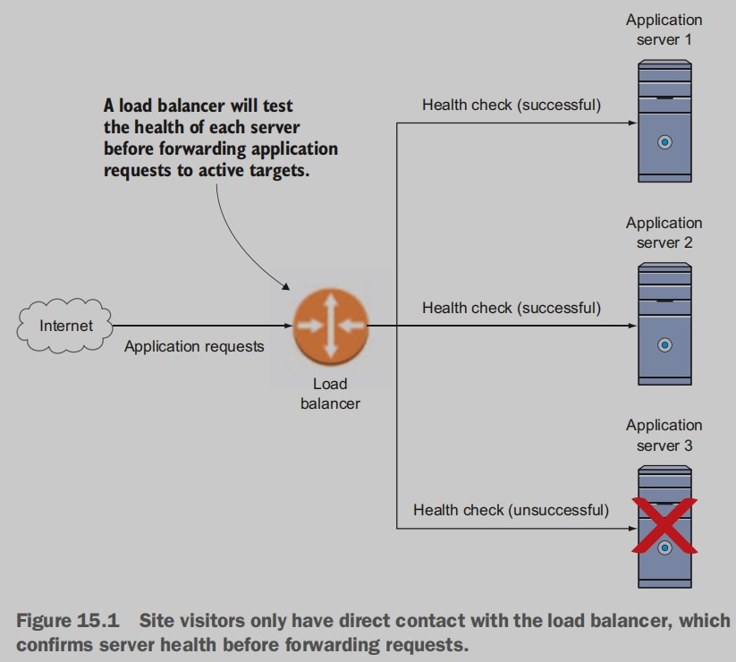
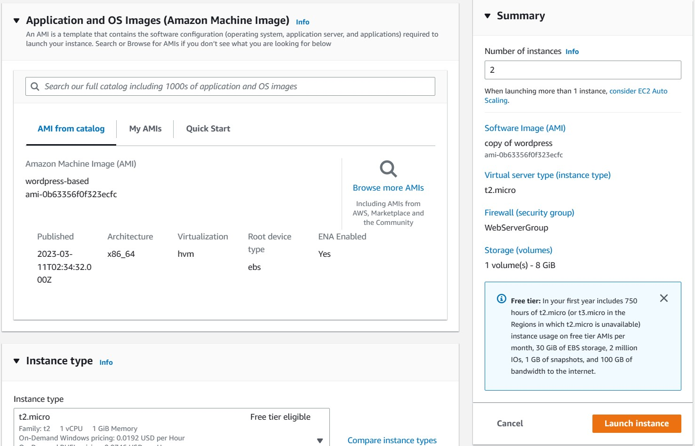
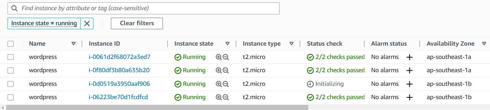
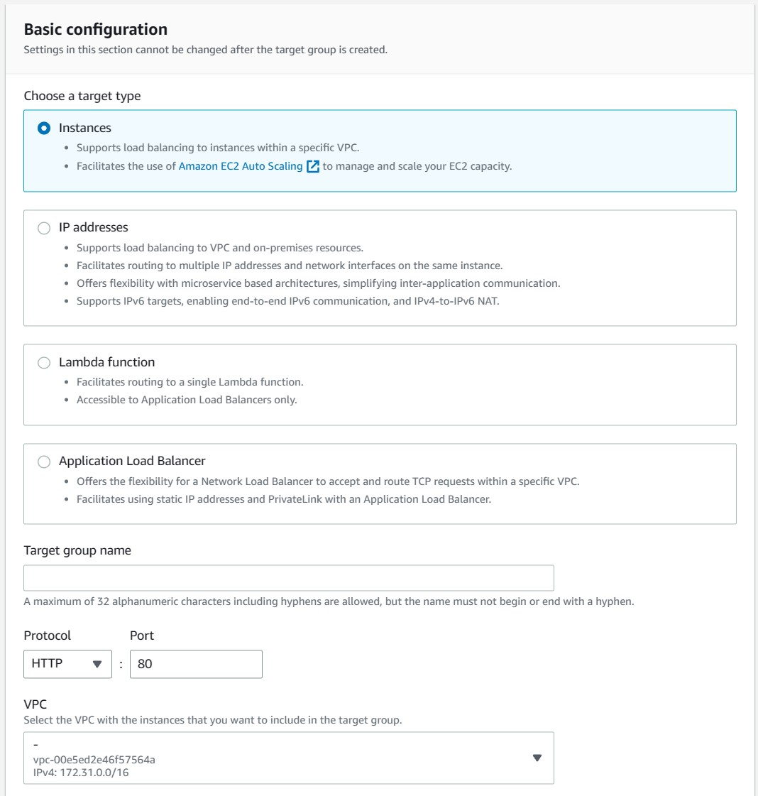
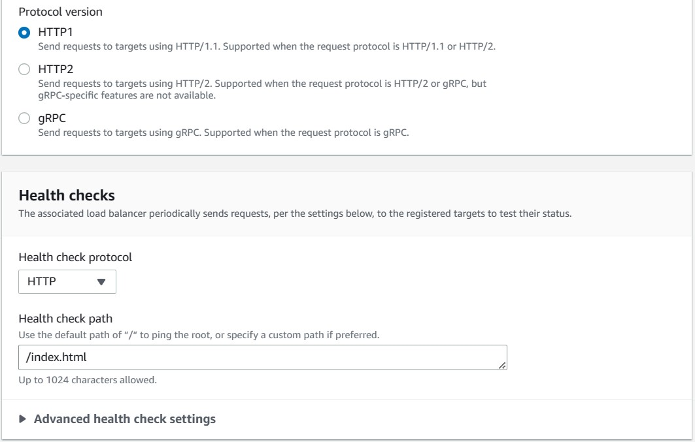
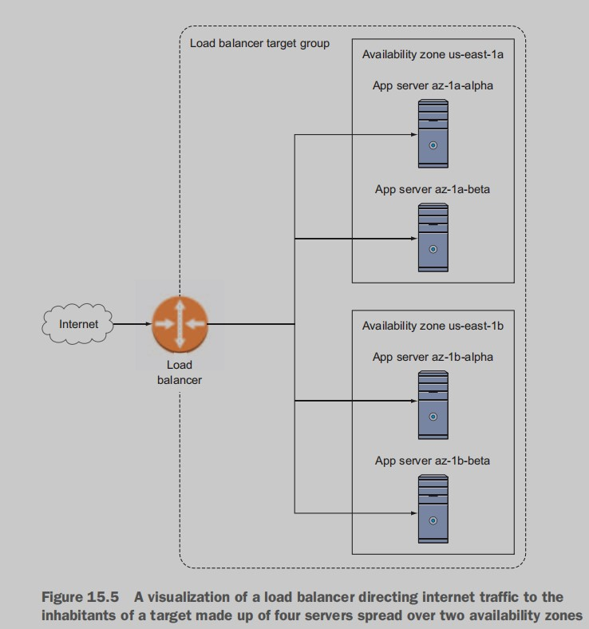
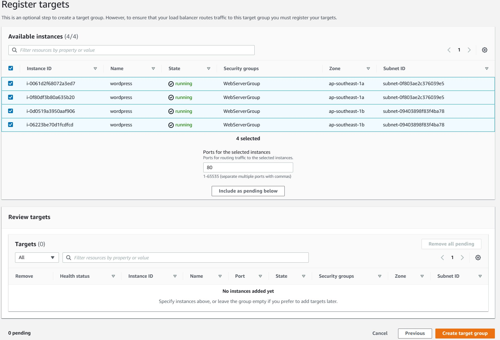
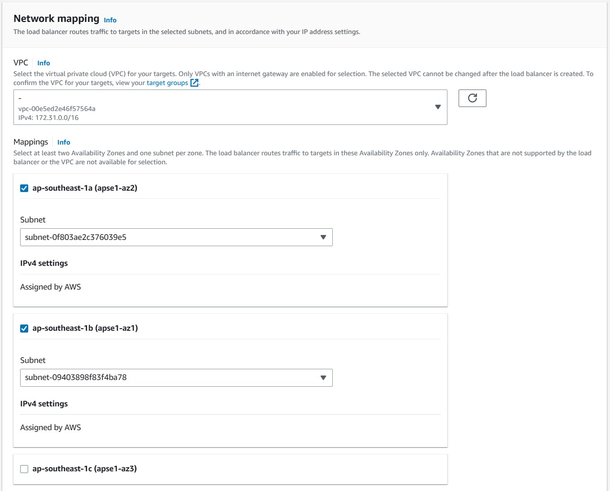
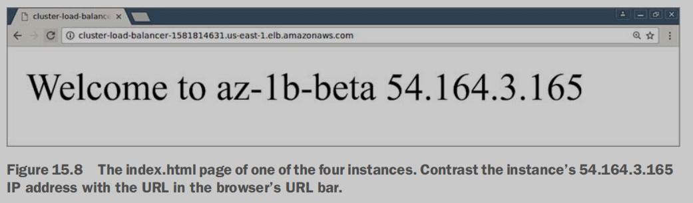

# High availability: load balancing
## 15.1 What is load balancing?
Like all load-balancing tools, Amazon’s Elastic Load Balancing
(ELB) system is designed for more than just managing **failovers**.
Failover, you’ll recall, is the automatic transfer of server tasks from a
failed instance to an identical replacement. As the term load balancer suggests, ELB’s overall mandate is to balance traffic loads among multiple resources to satisfy defined efficiency and performance needs.

we’re mainly interested in how
load balancing can generate high availability (figure 15.1). A welldesigned balancer can do the following:
- Listen for traffic aimed at your web application
- Keep track of the health and availability of each of your application servers
- Redirect incoming traffic among only the servers that are currently able to 



Once a load balancer is configured with the addresses of all of your
servers, organized into what AWS called target groups, its own network
address becomes the only URL your users need to access. Visitors don’t
need to know the individual DNS or IP addresses of each of your servers—nor do they have to worry about which ones are best prepared to handle their needs. As long as you’ve set your load balancer to listen for
requests against a particular address and associated your application’s
DNS address with the balancer’s endpoint—which, for AWS balancers, is
provided as part of the balancer description you’ll see later—all that is
taken care of automatically and invisibly.

## 15.2 Building a multizone load balancer
You’ll first launch four EC2 instances into two separate availability zones
(or subnets). For convenience, those four instances will all use the
**WordPress-based AMI** created in chapter 12. But you can use anything
you like, as long as each instance has a web server package (Apache)
installed.

To make it easier to keep track of things, create an index.html file in
the web root directory (`/var/www/html` on my Ubuntu AMI) of each
instance. This file should contain a simple welcome message identifying
the instance by the name you gave it and by its IP address.

Once the instances are running, you’ll need to jump through these five
hoops to get a load balancer on the job:
1. Create a target group, and configure a health check.
2. Register your four instances with the target group.
3. Create a load balancer, and associate it with the two subnets hosting your instances.
4. Create a security group for both instances and for the load balancer.
5. Associate your target group with the load balancer.

### 15.2.1 Launching four instances


The only other thing is to remember to create a security group that
opens HTTP (port 80) access to any incoming traffic. Name the group
cluster-instances, because you’ll use it not only for these instances, but
also for the load balancer.



Figure 15.3 The EC2 Instances dashboard, displaying each running instance’s zone and state

### 15.2.2 Creating a target group
First, you need to add all of
your instances into a target group that defines how the load balancer
will redirect incoming traffic to your app servers and, just as important,
how it will perform health checks.



Figure 15.4 The target group configuration includes setting the path to the file you want 
to use for health-check confirmation.

Entering the correct path to be used for health checks is a big deal. This
path points to a file on an application server that the load balancer will
regularly try to load. As long as the file loads successfully, the load balancer will assume everything’s fine. But if the request fails a preset number of attempts, the server will be declared dead, and no new traffic will
be directed to it.

### 15.2.3 Registering instances in a target group




Figure 15.6 The four instances, now fully registered in the target group

### 15.2.4 Creating a load balancer, and associating it with a security group
From there, click the blue Create Load Balancer button,
and you’ll be presented with—a tough choice. Do you want an Application Load Balancer or a Classic? What’s the difference?


Selected Application Load Balancer.
Give the balancer a descriptive name. Assuming you’re just kicking
the tires, rather than launching an actual production environment,
stick to the HTTP protocol for your listener (the other option is
HTTPS), and use the other default values. Of course, when you’re ready
to apply this to a real web application, HTTPS will be the only choice.
 
Scroll down the page to the Availability Zones configuration (figure
15.7), and select the two zones (subnets) into which you launched your
instances from the Available list.



Figure 15.7 You must add subnets from at least two availability zones to benefit from a load balancer.

### 15.2.5 Associating the target with the load balancer
Here’s where you connect the target group you created—with
its registry of active instances and health-check settings—with the load
balancer. Rather than creating a new target group, click the Target
Group drop-down menu and select Existing Target Group.

## 15.3 Testing the cluster
Earlier, you created unique index.html pages on each of the four
instances. You could still access the WordPress account using its normal
URL, but the index.html files will let you see exactly how the load balancer is handling things. On the Load Balancers dashboard, with your
cluster load balancer selected, you’re shown the balancer’s public DNS
name, which looks something like this:
```
Cluster-load-balancer-579837535.us-east-1.elb.amazonaws.com
```


