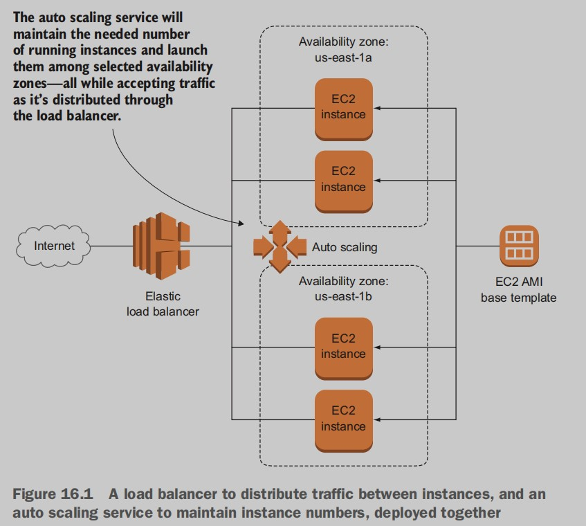
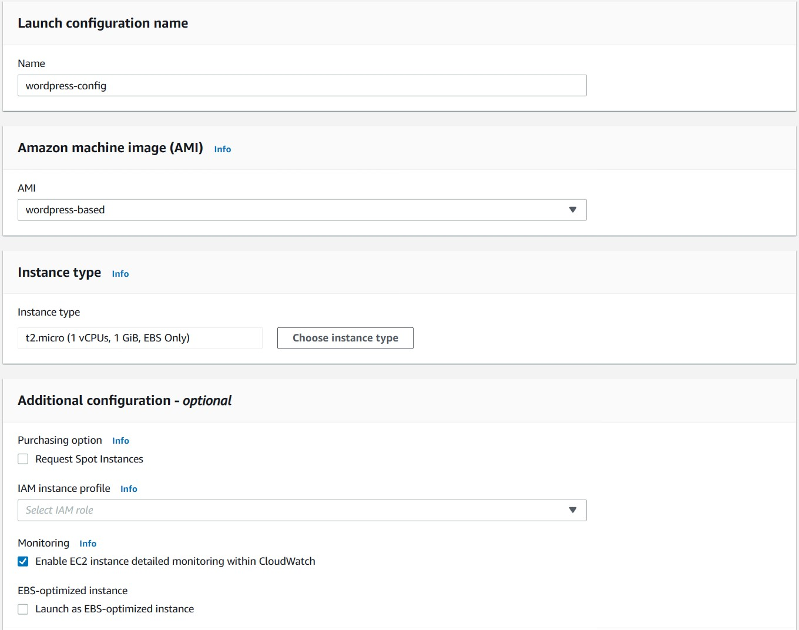
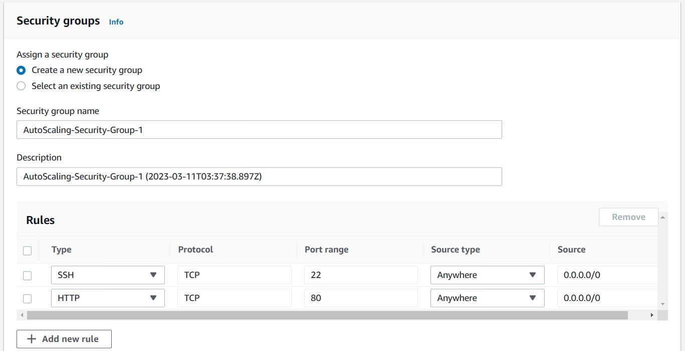
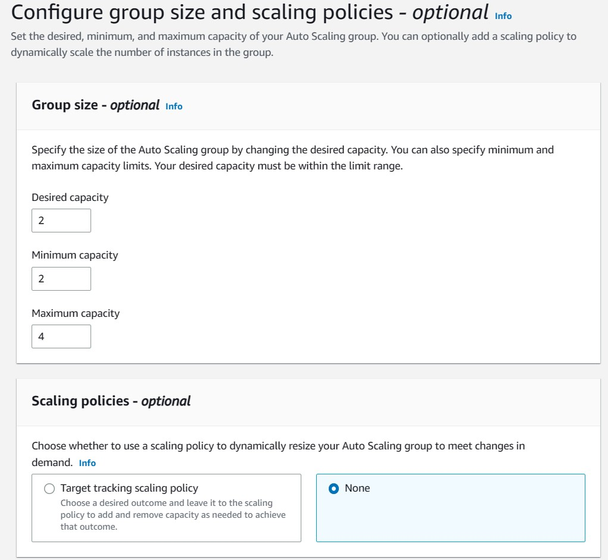

# High availability: auto scaling
Load balancers can keep
what you’ve got running nicely, but they’re not built to manage
change. If you’re worried that unexpected server downtime or
increased demand can leave your application unable to properly do
its job, you’ll need to find a way to add capacity. But you’ll have to
look beyond load balancers, to **auto scaling**.

 In this chapter, you’ll learn how to use auto scaling to do two
things: automate the replacement of instances when they fail, and
increase or decrease the number of instances you’re running to keep
up with changing customer demand.

Predictably, the two main principles of auto scaling are
- *Auto*—Things made to happen without active human intervention
- *Scaling*—Where capacity is scaled up or down depending on 

## 16.1 Creating a launch configuration

## 16.2 Creating an auto scaling group
### 16.2.1 Integrating a load balancer
You’ll obviously still be running your load balancer, which is an integral
part of your high-availability plans. But to make it all work, you need to
specify how to find your balancer—or, more specifically, the target
group being used by your balancer.

### 16.2.2 Configuring scaling policies

I chose to set the minimum number of running instances to two and
the maximum to four. That means even if there are no live instances
when the scaling group starts up, two will immediately be launched and
maintained. If demand grows, the scaling group will raise that number
as high as four, but no further.

You can also add a notification to a topic that defines an email or
text-messaging address where alerts can be sent. You can create a new
topic or, as I did, use the one created back in chapter 11.

## 16.3 Cleaning up after yourself
Here’s a fun game you can play: try shutting down all the EC2 instances
from the Instances dashboard. It’s a futile effort, right? The minute you
kill one instance, another one is spawned in its place. That would be
your auto scaling group faithfully doing the job no one ever told it to
stop doing.