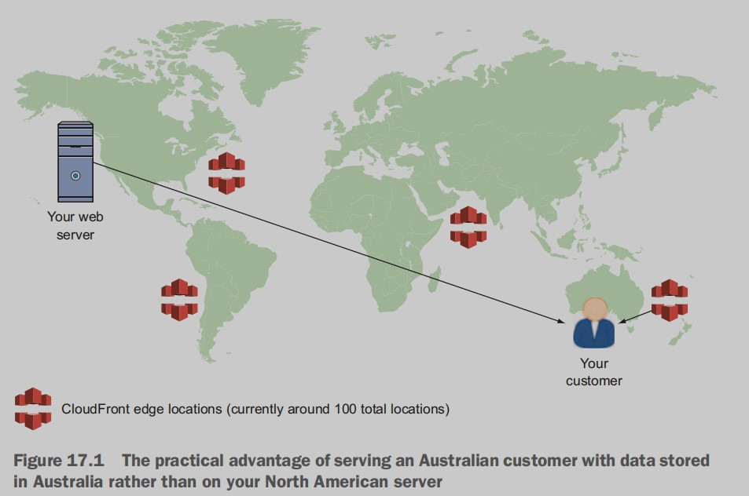
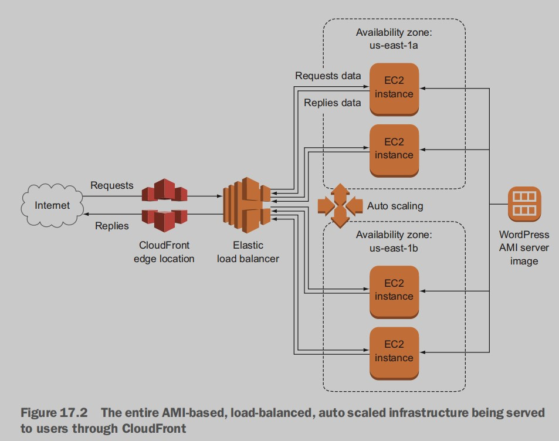
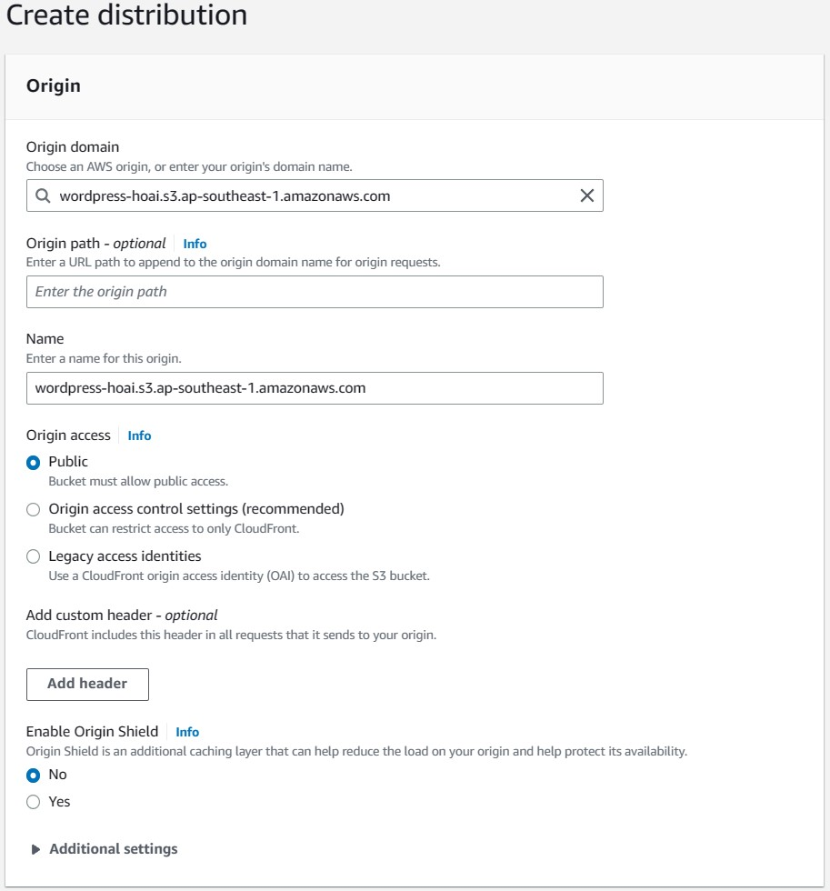
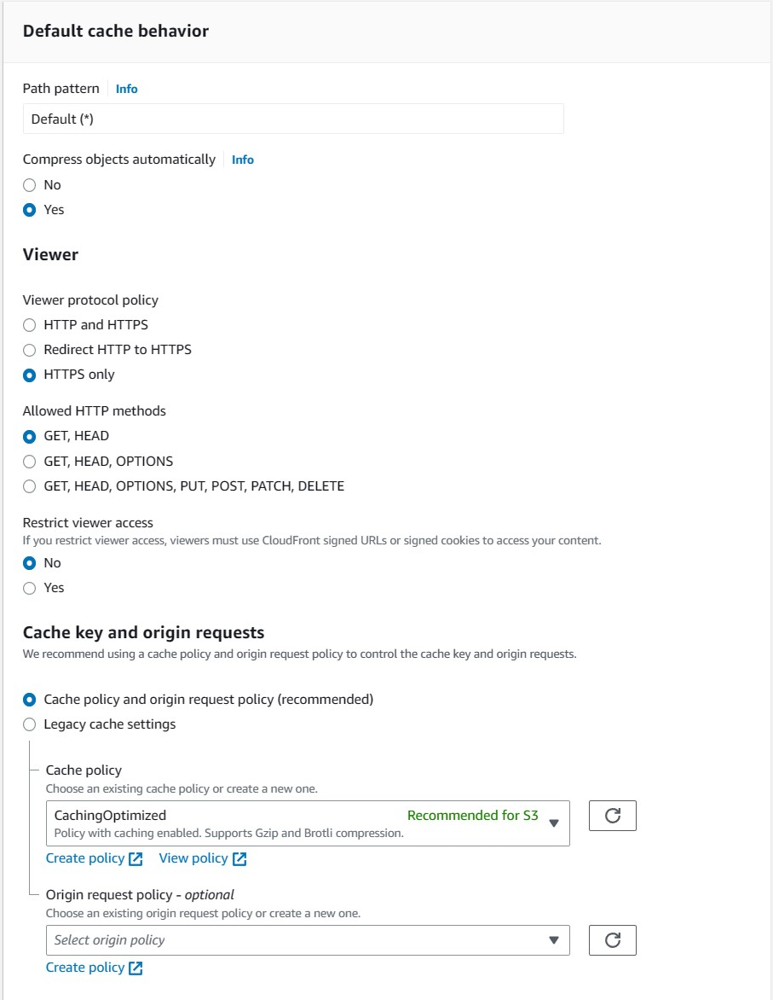
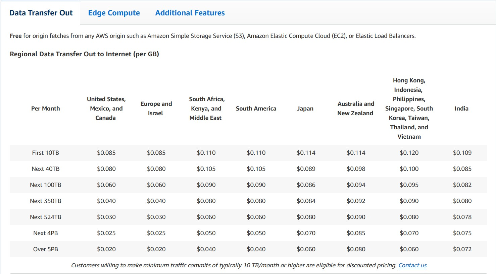

# High availability: content-delivery networks
## 17.1 How does Amazon CloudFront work?
A content-delivery network (CDN - sometimes also known as *edge caching*) takes snapshots of your
website that it can store on a network of servers spread all around the
world. If the URL used by a user on a different continent routes its
request to load a page on your website through the CDN, your web
server may never need to know about it. That’s because, rather than
transporting the original data all the way from your web server to the
distant user, the cached version kept on the CDN server that’s physically
closest to the customer is sent. Figure 17.1 illustrates how this works;
keep in mind that there are many, many more edge locations than
those depicted in this image.

In this chapter, you’ll create a CloudFront distribution that will serve the
content of your WordPress application through the cluster load balancer
you’ve been using over the past couple of chapters; see figure 17.2. You’ll
point CloudFront to your load balancer endpoint (URL) and work
through the configuration details.

## 17.2 Creating a CloudFront distribution

Figure 17.3 Here’s where you tell CloudFront where and how to access the data on your 
origin server.

### 17.2.1 SSL/TLS encryption
website encryption using Transport Layer Security (TLS) rather than
the long-deprecated Secure Sockets Layer (SSL) encryption technology.
CloudFront distributions can enforce encrypted communications at
either or both of two stages: transfers between the origin server and
CloudFront edge locations, and transfers between edge locations and
your end users. You can set encryption for either one without the other.

### 17.2.2 Other settings

### 17.2.3 CloudFront costs

Figure 17.6 CloudFront transfer costs broken down by region and volume. Notice the Reserved 
Capacity Pricing option in the right column, for large enterprise operations.
### 17.2.4 SSL/TLS certificates
AWS—through the AWS Certificate Manager—will painlessly provide you with all the
certificates you’ll need, free of charge. At this point, certificates are only
available for Elastic Load Balancer and CloudFront, but that fits your
current needs perfectly.