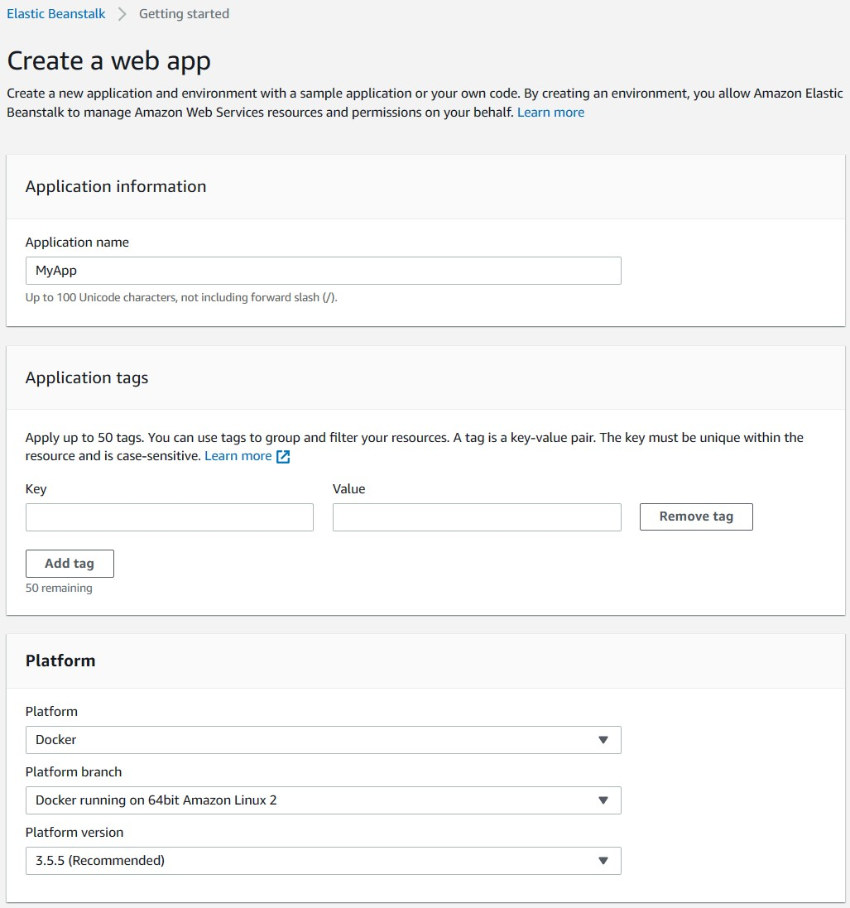
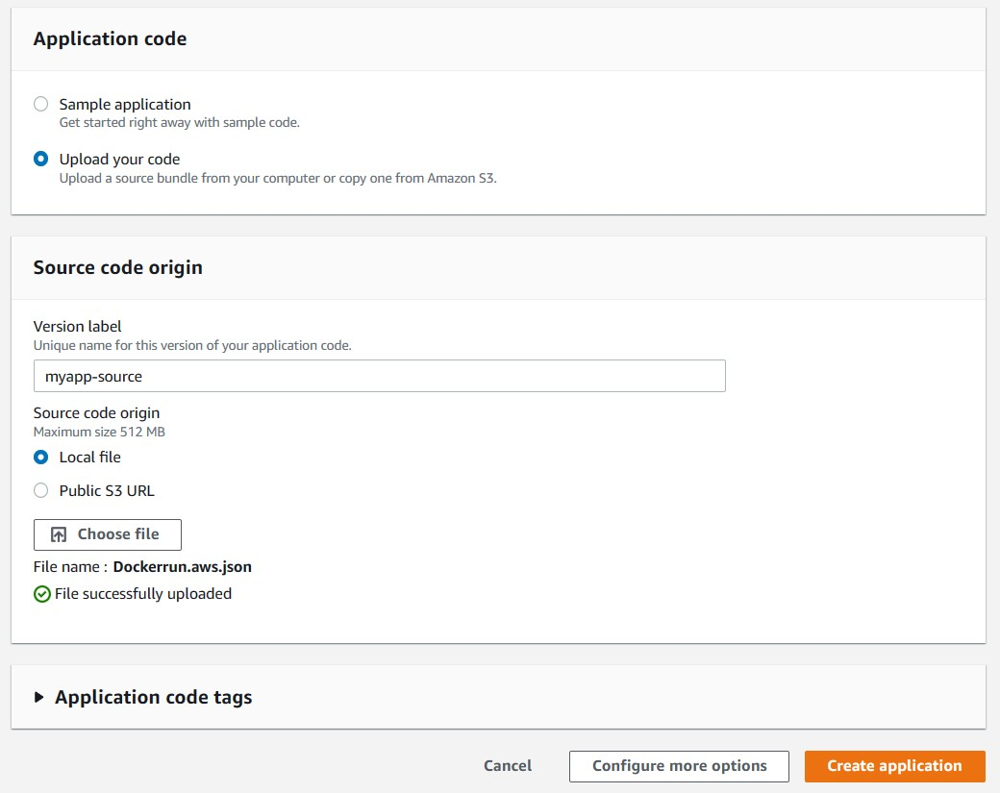
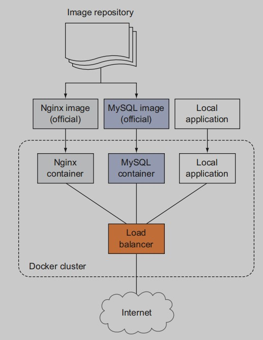

# Cloud automation: working with Elastic Beanstalk, Docker, and Lambda
Cloud computing is all about automating user access to compute
and network resources, so it makes sense that the resources themselves should be offered behind an increasingly automated interface.
In this chapter, you’ll learn a little about three AWS services, each
operating on its own level of automation abstraction:
- AWS *Elastic Beanstalk*—The infrastructure exists but is hidden
from the user.
- *Docker on AWS EC2 Container Service*—The infrastructure is virtualized.


## 19.1 AWS Elastic Beanstalk: what you don’t see won’t hurt you
Beanstalk can reproduce the whole thing from a single text file. In 5
minutes. Forget about a month of lunches; you can clear this one while
waiting for your coffee to heat up.

How’s that work? Head over to the Elastic Beanstalk dashboard, and
choose to create a web app. Give your app a name, select Multi-container
Docker from the Platform drop-down, and select Upload Your Code.

What code will you upload? Create a plain-text file named `Dockerrun.aws.json`, and type or paste into it the following JSON-formatted text.
Then, compress the file as a zip archive. (You may want to change the
two password values first.)

**Listing 19.1 Dockerrun.aws.json**
```
{
    "AWSEBDockerrunVersion": 2,
        "containerDefinitions": [
        {
            "name": "mariadb",
            "image": "mariadb:latest",
            "essential": true,
            "memory": 128,
            "portMappings": [
                {
                    "hostPort": 3306,
                    "containerPort": 3306
                }
            ],
            "environment": [
                {
                    "name": "MYSQL_ROOT_PASSWORD",
                    "value": "password"
                },
                {
                    "name": "MYSQL_DATABASE",
                    "value": "wordpress"
                } 
            ]
        },
        {
            "name": "wordpress",
            "image": "wordpress",
            "essential": true,
            "memory": 128,
            "portMappings": [
                {
                    "hostPort": 80,
                    "containerPort": 80
                }
            ],
            "links": [
                "mariadb"
            ],
            "environment": [
                {
                    "name": "MYSQL_ROOT_PASSWORD",
                    "value": "password"
                } 
            ] 
        } 
    ] 
}
```



Once the file is uploaded, click Create Application, and wait the 5 or 10
minutes it will take for your application to load. Then, follow the URL
you’re shown to visit your WordPress setup page, all fully supported by
some serious resource infrastructure.

Give the containers a few extra minutes to get themselves settled,
and then, from the WordPress setup page, try using root for the username; and instead of localhost for the database host, try mariadb (the
name you gave to the database container). Enter the password you
included in the Dockerrun.aws.json file.

## 19.2 AWS EC2 Container Service: running Docker in the cloud
A Docker instance is called a *container*. If you haven’t yet run into one in person, here’s what to expect: containers are extremely lightweight, softwaredriven virtual servers that can be configured and launched to perform
highly customized tasks. The technology isn’t exclusive to AWS; but the
things Docker does well fit so nicely with the environments that AWS
offers that the two were destined from birth to marry.



Images can be pulled from 
repositories, deployed into Docker 
clusters as interdependent containers, 
and connected to public networks.

The EC2 Container Service (ECS)
makes it easy—well, perhaps makes it possible is a bit more accurate—to
manage large clusters of Docker containers. To get started, you can
deploy purpose-built, Docker-ready EC2 instances, launched using the
Amazon Elastic Container Service.

The kind of interdependent microservices cluster that the Elastic
Beanstalk WordPress example illustrated is just as possible using ECS.
But whereas Beanstalk is built around code and scripts of one sort or
another—and can also be used for non-Docker applications—ECS adds
a more hands-on, visual, ongoing administrative experience.

## 19.3 AWS Lambda: going serverless
Using *serverless* architectures like
AWS Lambda, cloud-based compute functions can now be launched,
executed, and shut down completely independent of anything that
even looks like a server. There’s no logging in to a **Lambda server**,
because there’s no server to log in to.

The idea behind serverless is that events happening in other AWS
services can be configured to trigger the quick execution of a function
using only the bare minimum of cloud resources needed to spawn an
action.The classic example to illustrate the way it works is the old
generate-a-thumbnail-from-an-image-file trick; and really, who doesn’t
need to generate thumbnails from images every now and then?

Here’s how it goes: whenever a customer of your online imagestorage business saves a photograph to your S3 bucket, a Lambda function springs to life, creates a small thumbnail version of the image, saves it to a second bucket, and associates the two images so the thumbnail will appear as a proxy of the original in website displays. You don’t need to run (and pay for) an entire EC2 instance 24 hours a day, just in case a few cute kitten pictures show up. Instead, you run exactly what you
need, exactly when you need it. You upload or write the
code you’d like Lambda to run in response to triggers.

### 19.3.1 The server is dead; long live serverless—?
When should you choose Lambda? If your task is relatively small,
infrequent, and independent of other processes, then Lambda is a nobrainer. On the other hand, if it’s one piece in a larger, deeply interconnected mega-process driven by a very large code base that would be hard to refactor, you should think carefully before jumping on the Lambda bandwagon. Everything that falls somewhere in between will require you to make a judgment call, weighing all the factors as you find the right balance.