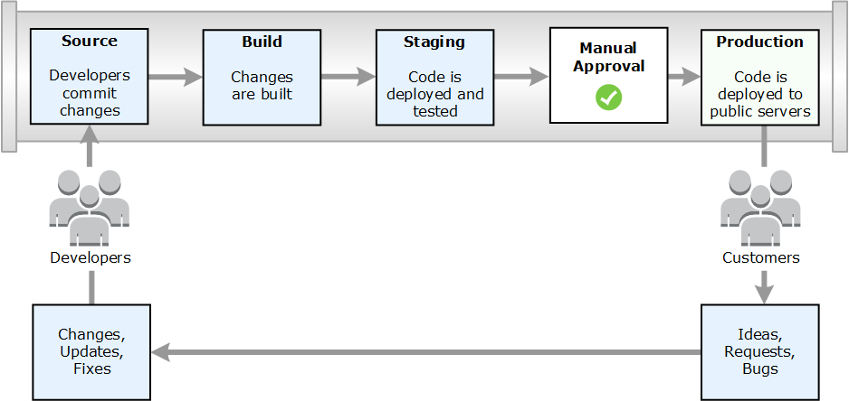
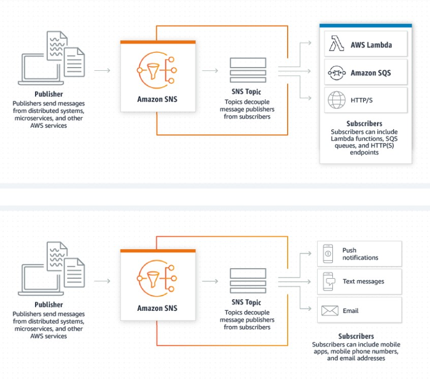

# Everything else (nearly)
Before I get started, I’ll point out that we certainly haven’t been
wasting our time. The first 18 chapters of the book (skipping over
chapter 19) explored more than a dozen individual services; see
table 20.1.

Table 20.1 Services covered in this book, arranged by AWS service category

|Category |Service | Chapter(s)|
|---------|--------|-----------|
|Compute |EC2   | 2, 3, 15, 16|
|Storage |S3  Glacier  Storage Gateway |6, 7  18  18|
|Databases|Relational Database Service| 4|
|Networking| VPC  CloudFront  Direct Connec  Route 53|14  17  18  5|
|Migration |Snowball |18|
|Management tools| CloudWatch |11|
|Security |IAM  Certificate Manager| 8  7|

## 20.1 Databases
There’s more than one way to manage data. In addition to RDS, Amazon has a whole whack of database engines, including DynamoDB, Redshift, and ElastiCache.

### 20.1.1 DynamoDB
 I’ll note that the data you add to your DynamoDB table is organized in **key-value** stores. A key is an identifying string or number used to partition data within large data tables.

DynamoDB databases can be managed from the AWS Console; figure
20.1 shows how to set up a database. You can do a surprising amount of
configuration, monitoring, and even data importing and exporting
from the console. But the most common way to consume the service is
from program code, using DynamoDB bindings that are available for all
major programming languages.

### 20.1.2 Redshift
If you’re looking to efficiently manage petabyte-scale data stores (often referred to as data warehouses) and
dynamically mine them for their business intelligence, then forget
about RDS or DynamoDB. It’s Redshift you’re after.

Redshift is a hosted and managed service designed for massive parallel processing, built on the PostgreSQL relational database engine.

Redshift can connect to data sources using either the Open Database
Connectivity (ODBC) or Java Database Connectivity (JDBC) API. Once
connected, you should be able to deeply analyze and transform data
and generate useful business intelligence–oriented reports.

### 20.1.3 ElastiCache
Cache keeping the data in a
volatile memory store (like RAM) rather than on a disk. Storing data
that way is usually more expensive, but the resulting improved performance often justifies the cost.

ElastiCache is a fully managed service that can use either the Memcached or Redis caching engine. When launched, fed its data, and
applied against the right kind of deployments, ElastiCache can greatly
reduce bottlenecks in data transfers and, by shifting a heavy transaction
burden away from back-end databases, even significantly cut operational costs. It might be worth your while to research some of the creative ways people are using caching in your particular field.

## 20.2 Developer tools
- *Software development kits (SDKs)*—Programming frameworks
designed to ease application creation using all major programming languages (Java, .NET, Python, and so on) and platforms
(Android, iOS, and so on) from any major OS. 
- *Integrated development environment (IDE) toolkits*—Developers who
already do their coding on either the Eclipse or Visual Studio IDE
can add an AWS Toolkit as a plug-in to allow direct integration
with an AWS account and all its resources.

The Tools page also links to four developer-oriented services: **CodeCommit**, **CodeBuild**, **CodeDeploy**, and **CodePipeline**.

### 20.2.1 CodeCommit
Programming code can be complicated, and the complication is compounded when you have multiple team members contributing updates
and fixes. Keeping track of revisions and ensuring that only the right
people have access can easily make the difference between a project’s
success and failure.

With CodeCommit, AWS provides a Git-based service for individuals
and teams developing for the Amazon cloud. Of course, you need to
have Git installed on your local workstation. The value proposition?
Complete integration with AWS services—especially IAM for access
control.

### 20.2.2 CodeBuild
CI/CD attempts
to automate the process of moving a project from source code to a
deployment-ready build (aka *compiled*) state.

Why would you want to automate builds?  If you’re part of a team trying to complete a complex, multimodule project, then allowing each developer to run their
own builds can end in chaos.

One solution is to create a build farm server to which all team members have appropriate levels of access. That approach can work well but
can also be expensive and time consuming (and often under-utilized).

AWS’s CodeBuild is a virtual build farm that, in the venerable AWS
tradition, generates costs only when it’s used. And true to its cloud
roots, CodeBuild will automatically scale up to meet the seasonal heavy
demands of major releases or product fixes, and then scale back down
when calm descends on your team.

CodeBuild can handle workloads based on Java, Python, Node.js,
Ruby, Go, Android, and Docker runtimes, and it works with code coming from CodeCommit, GitHub, and S3.

### 20.2.3 CodeDeploy
Once you have a working application (either built using CodeBuild or
put together manually), you can use CodeDeploy to push it to live servers. Here’s the executive summary version of how CodeDeploy works.
So that the service will know what’s what, you include an application
specification file called AppSpec among the project files you upload to
a repository or an S3 bucket. From the CodeDeploy end (either through the Console or via the CLI), you let AWS know where your project files are stored and which of your EC2 instances are part of the
project’s deployment group and, therefore, targets for updates.

### 20.2.4 CodePipeline
CodePipeline can tie together all your developer tools (including CodeCommit, CodeBuild, and CodeDeploy) into a single, centrally managed, responsive workflow. It’s responsive in the sense that the service
detects changes to the environment it’s been told to watch and reacts by
pushing the updated objects through the pipeline all the way to your
production servers (if so instructed).

### 20.2.5 API Gateway
Amazon’s API Gateway can manage the **opening and closing of any API doors** you want associated with your applications. Whether those
apps are hosted on EC2 instances or running on Lambda, API Gateway
can be configured to accept, authorize, direct, process, and monitor your
API call traffic. Like many AWS tools, API Gateway is a pay-per-user service.

### 20.2.6 CloudFormation
**CloudFormation templates**—either sample templates provided by AWS or custom templates
you write yourself—define a stack of resources that you can quickly
deploy and administer. Because the templates exist within the CloudFormation environment, you can be sure that, once launched, each
individual element will be appropriately integrated with the rest and
that all the dependencies and parameters you define will be met.

By way of comparison, Elastic Beanstalk, discussed in chapter 19,
automatically and invisibly handles your application’s infrastructure for
you. By contrast, CloudFormation expects you to fully understand all
the infrastructure elements your application will require, but it simplifies the process by automating their practical coordination.

## 20.3 Security and authentication
### 20.3.1 AWS WAF and AWS Shield
**WAF (web application firewall)** as a tool
that can define the traffic you want to allow, using just about any characteristic. A WAF goes far further than testing for a particular network
protocol or origin IP address; it can read request headers and content
strings and check them against any conditions you set. This kind of filtering—which is far more detailed than anything possible using security
groups and network ACLs—is designed to fight back against a modern
problem: malicious website attacks.

When you configure your WAF, you specify conditions that can be
added to rules. One rule might state that if Condition A and Condition
B are both present in an incoming web request, then access will be
denied; otherwise, access will be granted.

**AWS Shield** is a distributed denial of service (DDoS) protection tool that’s automatically and freely active for
resources on all AWS accounts;
Shield Advanced is an optional (and for-purchase) service that offers
more-robust service whose features include DDoS response-team support and cost protection for any attack-related service charges to Route
53, CloudFront, and ELB. When tens of thousands of zombie servers
start up against you during a DDoS attack, it’s not uncommon to face
thousands of dollars of usage charges. That said, Shield Advanced protection isn’t cheap, starting at $3,000/month.

### 20.3.2 Cognito
WAFs—and to some degree security groups and network ACLs—defend
your resources from misuse. In other words, they prevent anyone from
using your applications in ways those apps weren’t meant to be used.
Amazon Cognito, on one level at least, solves an entirely different problem: how to distinguish among your users so you can serve each of them
appropriately.

## 20.4 Messaging
When you’re building and maintaining complicated projects involving
large teams and thousands or millions of users, strong communication
is king. Reliable messaging is sometimes the only thing that can hold all
the gears together and keep them turning productively. These days,
messaging isn’t the exclusive concern of human beings; machines and
machine processes want seats at the table, too.

### 20.4.1 SNS
You encountered AWS’s Simple Notification Service back in chapter 5,
when you told SNS to alert you if a Route 53 health check on a web server
failed. That was a pretty good illustration of the ways SNS can be neatly
integrated into your cloud workflow. In general terms, a publisher (the
Route 53 health check, in the example) sends a message to an existing
topic that’s already been associated with individual or multiple recipients
through a subscription (in the example case, my email address).

In addition to alerting human administrators through emails or SMS
text messages, SNS messages can also be directed at and consumed by
AWS services like Lambda and SQS, prompting them to spawn new processes in response. And in addition to targeting AWS services in subscriptions, you can push messages to mobile devices using one of a
number of available third-party push-notification services, including
Google Cloud Messaging for Android, Apple Push Notification Service,
and Windows Push Notification Service.

### 20.4.2 SQS
Amazon Simple Queue Service (SQS) is all about coordination and
ensuring that complex processes don’t break down due to broken communication among multiple parts.

### 20.4.3 SES
While your servers are happily chatting with each other via SNS and SQS,
perhaps you can have a quick word with your customers. Being able to
reach out to current and potential customers (without spamming them,
of course) is a huge business requirement. You want to efficiently manage large email lists to ensure that emails are delivered at the right time,
and to analyze rich data on how each campaign was received.

Looking for a single email marketing service to handle the heavy lifting (think: MailChimp)? Amazon Simple Email Service (SES) offers a
full-featured, mature platform that—of course—is both scalable and
integrated with the rest of your AWS infrastructure.

## 20.5 Shortcuts
Why reinvent the wheel if there’s an entire internet of helpful templates
out there? If you need to do something on AWS that involves a bewildering combination of services and configuration settings, you may not
always be in the mood to start from scratch. It’s worth a web search to
see if someone has already created a helpful guide or a script that can
get you on your feet fast.

### 20.5.1 AWS Quick Starts
The first place you should look is on the AWS Quick Starts page
(https://aws.amazon.com/quickstart). Quick Starts are fully documented guides to common solutions, provided by AWS partners. But
they’re more than guides: each Quick Start includes a link to launch
the template in your account using the AWS CloudFormation service.

The templates are organized by category (DevOps, Databases & Storage, and so on, as shown in figure 20.8). The DevOps category, for
instance, includes templates for firing up a Chef or Puppet server, a
Docker Datacenter, or an Atlassian JIRA deployment. Databases include
Microsoft SQL server and SAP HANA. Naturally, the template assumes
that you already have any licenses needed to run the software.

### 20.5.2 Migration shortcuts
You want to get your data and servers up and running on AWS as quickly
and painlessly as possible. As it turns out, that’s pretty high on AWS’s
wish list, too. After all, the sooner you’re online, the sooner AWS is earning revenue from your deployment. This pleasant confluence of shared
goals is probably what has driven Amazon to create migration tools to
help you over some of the more common transition hurdles.

The AWS Database Migration Service (DMS) claims to have successfully migrated more than 16,000 databases. Considering that DMS is a
relatively new service and that moving large, active databases halfway
across the planet can be a massively complex task, I’ll assume that’s a
pretty impressive number. (It’s also just refreshing to see an AWS-related
metric under a billion.)

You start DMS by identifying your local (source) database, a target
database on AWS, and a replication database that will exist only to support the migration operation. DMS can migrate a live database running
just about any popular engine. Using the AWS Schema Conversion Tool,
you can even convert to a different engine as part of the process.

Of course, AWS suggests that you consider converting to its MySQLcompatible Aurora database engine. And based on everything I’ve
heard about it so far, Aurora does rank as a serious contender.

Finally, you should be aware of the AWS Server Migration service,
which can simplify migrating local VMware virtual machines into EC2.
You’re never entirely on your own!