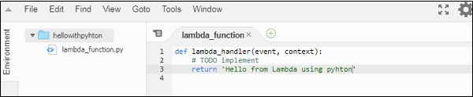

# AWS Lambda – Function in Python
In this chapter, we will create a simple AWS Lambda function in Python and understand its working concepts following detail.

## 1. CreateLambda function in AWS
we need AWS toolkit support for Python. For this purpose, follow the steps given below and observe the corresponding screenshots attached.

#### Step 1
Login to AWS console and create Lambda function and select the language as Python.


#### Step 2
Now, click Create function button and enter the details for creating a simple AWS Lambda in Python. This code returns the message Hello from Lambda using Python and looks as shown here



#### Step 3
Now, save the changes and the test the code to see the output. You should see the following output and logs when you test it in AWS console using the test button from the UI.


### Step 4
Now, you can write code inside any editor or an IDE for Python. Here, we are using visual studio code for writing the code. You should later zip the file and upload in AWS console.

### Step 5
Now, select Upload a .ZIP file option as shown below


## 2. Handler Details for Python
Note that the handler has to be name of the file followed by name of the function. In the above case, our file name is `hellopython.py` and name of the function is `my_handler`; so the handler will be `hellopython.my_handler`.


Once the upload is done and changes are saved, it actually shows the details of the zip file in the online editor in AWS Lambda console. Now, let us test the code to see the output and logs.


## 3. Context Object in Python
Context object gives details like the name of the Lambda function, time remaining in milliseconds, request id, cloud watch group name, timeout details etc.

The methods and attributes available on context object are shown in the tables given below

|Sr.No	|Method Name & Description|
|------|-------------------|
|1	|**get_remaining_time_in_millis()** <br>This method gives the remaining time in milliseconds until the lambda function terminates the function|

|Sr.No|	Attribute & Description|
|------|-------------------|
|1	|**function_name** <br>This gives aws lambda function name|
|2	|**function_version** <br>This gives the version of aws lambda function executing|
|3	|**invoked_function_arn** <br>This will gives ARN details.|
|4	|**memory_limit_in_mb** <br>This shows the memory limit added while creating lambda function|
|5	|**aws_request_id** <br>|This gives the aws request id.
|6	|**og_group_name** <br>This will give the name of the cloudwatch group name|
|7	|**log_stream_name** <br>This will give the name of the cloudwatch log stream name where the logs are written.|
|8	|**identity** <br>This will give details about amazon cognito identity provider when used with aws mobile sdk. Details given are as follows <br> - identity.cognito_identity_id <br> - identity.cognito_identity_pool_id|
|9	|**client_context** <br>This will details of the client application when used with aws mobile sdk. The details given are as follows  <br> - client_context.client.installation_id<br> - client_context.client.app_title <br> - client_context.client.app_version_name <br> - client_context.client.app_version_code <br> - client_context.client.app_package_name <br> - client_context.custom - it has dict of custom values from the mobile client app <br> - client_context.env - it has dict of environment details from the AWS Mobile SDK|

Let us see a working example in Python which outputs the context details. Observe the code given below
```
def my_handler(event, context):
   print("Log stream name:", context.log_stream_name)
   print("Log group name:",  context.log_group_name)
   print("Request ID:",context.aws_request_id)
   print("Mem. limits(MB):", context.memory_limit_in_mb)
   print("Time remaining (MS):", context.get_remaining_time_in_millis())
   return "aws lambda in python using zip file"
```


## 4. Logging using Python
To log info using Python, we can use print or logger function available. Let us use the above example of context and check inCloudWatch to see if the logs are printed.


