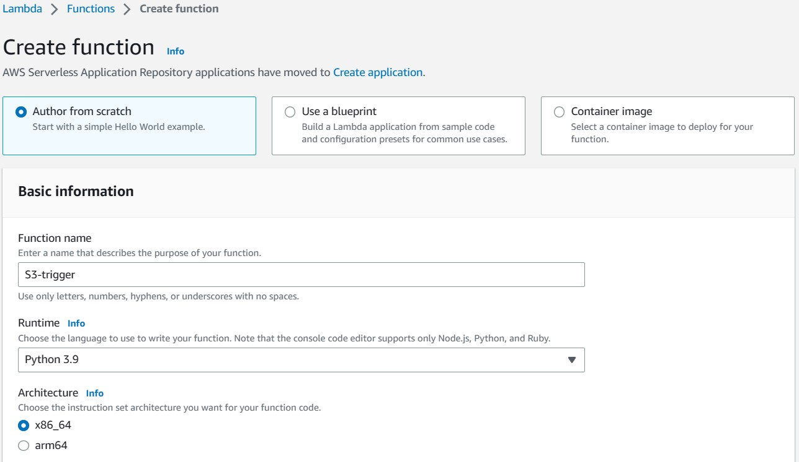
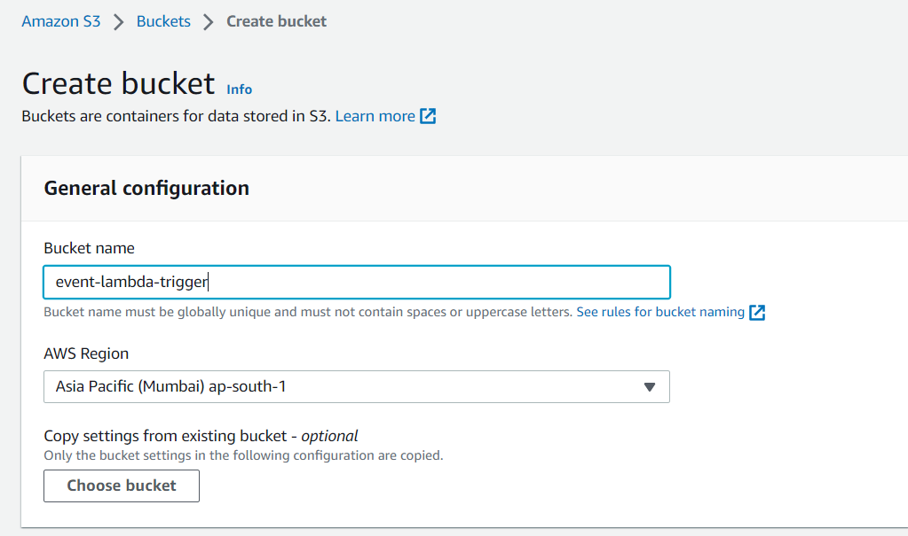
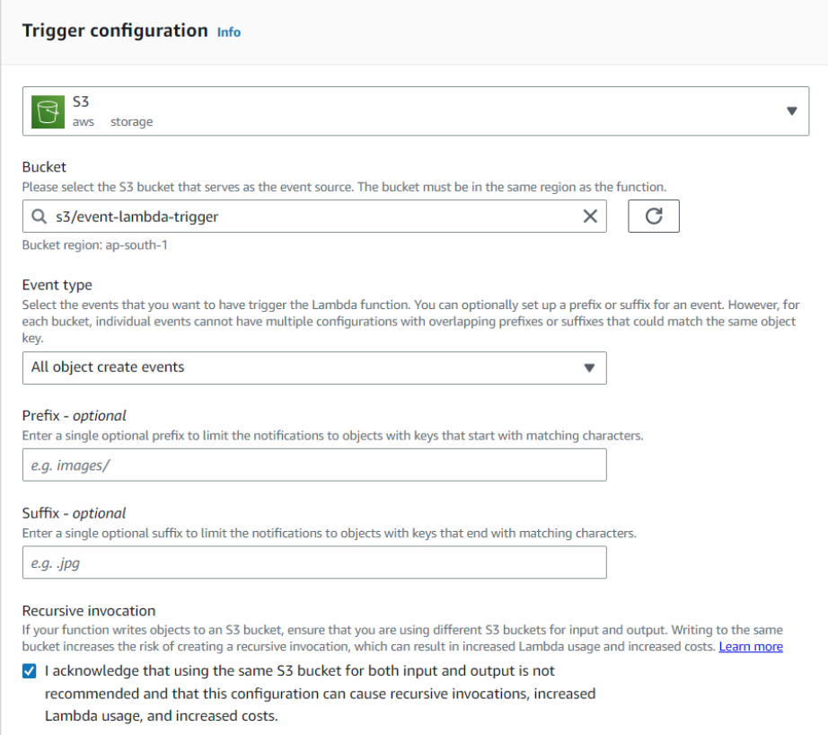
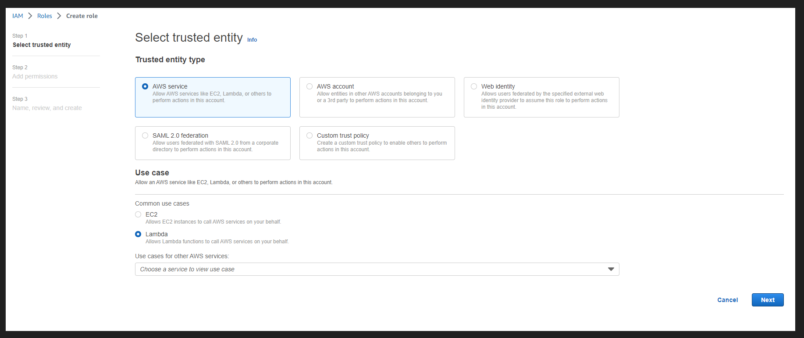
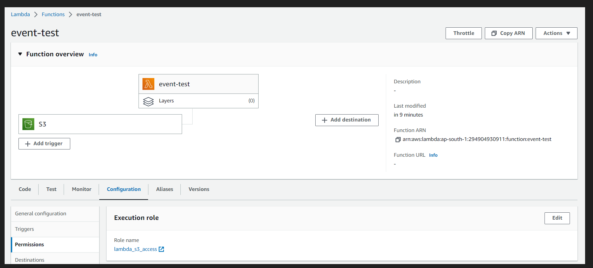

# Amazon S3 Trigger to Invoke a Lambda Function
## 1. Create a basic lambda function
**Step 1**: Go to AWS Console, search for Lambda, and choose the Create function.

**Step 2**: Select Author from scratch, give some function name, and choose the Runtime Environment. Leave the rest of the options as default.



**Step 3**: Click on the Test tab to invoke a function from the console.

**Step 4**: For the test event, create a new event and give an **Event name**. For **Event sharing settings**, choose **Private**, and for **Template**, leave it to default.

**Step 5**: Save it and then click on Test. You can see the logs from the Monitor tab. It will show the logs which Lambda sends to **CloudWatch**.
## 2. S3 Trigger to Invoke Lambda Function
### 2.1 Create a bucket
**Step 1**: Open AWS Console and search for S3. Click on Create bucket.

**Step 2**: Under General Configuration, enter a unique bucket name and select the AWS Region. Leave the rest of the options as it is and click on Create bucket.



>**Note**: The bucket AWS Region and Lambda function AWS Region should be the same.

### 2.2 Modify the existing Lambda Function and Create an IAM Role for Lambda Function
**Step 1**: Click on **Add Trigger** and select s3 from the list. Select **All objects to create events** in the **Event type**.



**Step 2**: Create an IAM Role for Full S3 Access and Full CloudWatch Access. From IAM Roles, click on Create role. Select **AWS service** from the **Trusted entity type** and select **Lambda** from the **Use case**. Click on Next.



**Step 3**: From Permission policies, select **AmazonS3FullAccess** and **CloudWatchFullAccess** and click on Next.

**Step 4**: Give the Role name and leave the rest of the fields with a default value. Click on Create role.

**Step 5**: Once the role is created, go to your existing lambda function and add Permission.



**Step 6**: Go to the lambda_handler function and change the existing code. To access the **S3 object**, you need ``Boto3`. Boto3 is Python SDK to access **AWS services**, and by default, it comes with a lambda function, so you don’t have to install it explicitly.

```
import boto3
from urllib.parse import unquote_plus
def lambda_handler(event, context):
    """Read file from s3 on trigger."""
    s3 = boto3.client("s3")
    if event:
        file_obj = event["Records"][0]
        bucketname = str(file_obj["s3"]["bucket"]["name"])
        filename = unquote_plus(str(file_obj["s3"]["object"]["key"]))
        print("Filename: ", filename)
        fileObj = s3.get_object(Bucket=bucketname, Key=filename)
        file_content = fileObj["Body"].read().decode("utf-8")
        print(file_content)
    return "File is uploaded in S3"
```

**Step 7**: Upload a file in your bucket.

**Step 8**: Go to CloudWatch and check the logs.

## 3. Conclusion
S3, you can build more automated and scalable workflows for your data and easily integrate S3 with other AWS services to create powerful, serverless applications.

Some of the key takeaways from the article are:

- You have learned how to create a basic lambda function.
- You have also learned how to add IAM Role to get full access to Amazon S3 and CloudWatch.
- You have also learned how a lambda function is invoked when you upload an object in an S3 bucket.
- You can configure S3 to automatically resize an image when it’s uploaded to a specific bucket.
- You can configure S3 to automatically create a backup of an object when it’s created or updated.
- You can configure S3 to automatically trigger an AWS Lambda function to process data when it’s uploaded to a specific bucket.
- You can use Lambda Layers to manage common dependencies for your Lambda functions in a separate layer.