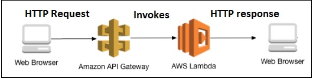

# API gateway trigger lambda 
## 1. API Gateway
Amazon API Gateway is a fully managed service that makes it easy for developers to create, publish, maintain, monitor, and secure APIs at any scale. APIs act as the "front door" for applications to access data, business logic, or functionality from your backend services. Using API Gateway, you can create RESTful APIs and WebSocket APIs that enable real-time two-way communication applications. API Gateway supports containerized and serverless workloads, as well as web applications.

API Gateway handles all the tasks involved in accepting and processing up to hundreds of thousands of concurrent API calls, including traffic management, CORS support, authorization and access control, throttling, monitoring, and API version management. API Gateway has no minimum fees or startup costs. You pay for the API calls you receive and the amount of data transferred out and, with the API Gateway tiered pricing model, you can reduce your cost as your API usage scales.

## 1.1 API Types
**RESTful APIs**\
Build RESTful APIs optimized for serverless workloads and HTTP backends using HTTP APIs. **HTTP APIs** are the best choice for building APIs that only require API proxy functionality. If your APIs require API proxy functionality and API management features in a single solution, API Gateway also offers [**REST APIs**](https://docs.aws.amazon.com/apigateway/latest/developerguide/http-api-vs-rest.html).

**WEBSOCKET APIs** \
Build real-time two-way communication applications, such as chat apps and streaming dashboards, with WebSocket APIs. API Gateway maintains a persistent connection to handle message transfer between your backend service and your clients.

## 1.2 How API Gateway Works
A basic diagram that explains the working of API gateway and AWS Lambda


## 2. Creating API Gateway to trigger Lambda Function
**Processes involved** following are the processes involved in working with AWS lambda and API Gateway −
1. Create IAM role for permission
2. Create AWS lambda function
3. Create API Gateway
4. Link lambda function to api gateway
5. Passing data to api gateway

### 2.1 Create IAM role for permission
- From Amazon services, select **IAM** for creating roles to be used by Lambda function.
- Go to IAM and select **Roles** from left side section
- Click **Create role** for Lambda function.
- Select Lambda and click **Permissions** at the bottom. Select the permission required for the API Gateway and Lambda.
    + Search and choose `AmzonAPIGatewayInvokeFullAccess`
    + Search and choose `AmzonLambdaFullAccess`
- Enter the name of the role as per your choice
- Click **Create role** and we are done with the role creation

### 2.2 Create AWS Lambda Function
- Go to AWS services and click on **Lambda** service
- Click **Create function** button
- Enter name `API-gateway-trigger` and choose the existing role which we have created above.
- Choose **Runtime** is `Python 3.8` and **Architecture** is `x84_64`
- Change **lambda_function.py** with content below:
    ```
    import json
    import uuid

    GET_RAW_PATH = "/getPerson"
    CREATE_RAW_PATH = "/createPerson"

    def lambda_handler(event, context):
        print(event)
        if event['rawPath'] == GET_RAW_PATH:
            print('Received getPerson request')
            decodedBody = json.loads(event['body'])
            personId =  decodedBody['personId']
            print("with param personId=" + personId)
            return { "firstName": "Hoai " + personId, "lastName": "Tran", "email": "hoaitran@gmail.com" }

        elif event['rawPath'] == CREATE_RAW_PATH:
            print('Received createPerson request')
            decodedBody = json.loads(event['body'])
            firstname = decodedBody['firstname']
            print('with param firstname=' + firstname)
            return { "personId": str(uuid.uuid1())}
    ```
- Click on **Deploy**

### 2.3 Create API Gateway
- From Amazon services, select **API Gateway**
- Choose the **HTTP API**.Then click on **Build**
- At **Create and configure integrations**
    + Choose `Lambda` at **Integrations**
    + Select **Lambda function**
    + Enter API name `API-Lambda-trigger`
- At **Configure routes**
    + Create **GET** method: `/getPerson`
    + Create **POSST** method: `/createPerson`
- Select **Stage name** at `$default`
- Click **Create**

### 2.4 Add trigger to Lambda function
- From Lambda function, click **Add trigger**
- At **Trigger configuration**
    +  Choose **API Gateway** at field select source
    + Choose **Use existing API** with IP ID
    + **Deployment stage** is `$default`
    + **Security** chosse **Open**

## 3. Test API Gateway trigger
Test **GET** method
```
curl -X GET https://65haw6qabi.execute-api.ap-southeast-1.amazonaws.com/getPerson -H 'Content-Type: application/json' -d '{"personId":"815005c8-cabf-11ed-8398-ae71598d9e50"}'
```
The response will be:
```
{
"firstName": "Hoai 815005c8-cabf-11ed-8398-ae71598d9e50",
"lastName": "Tran",
"email": "hoaitran@gmail.com"
}
```

Test **POST** method
```
curl -X POST https://65haw6qabi.execute-api.ap-southeast-1.amazonaws.com/createPerson -H 'Content-Type: application/json' -d '{"firstname":"Naincy"}'
```
The response will be:
```
{
  "personId": "6a01d088-cae0-11ed-8706-2e6d410f2a82"
}
```
